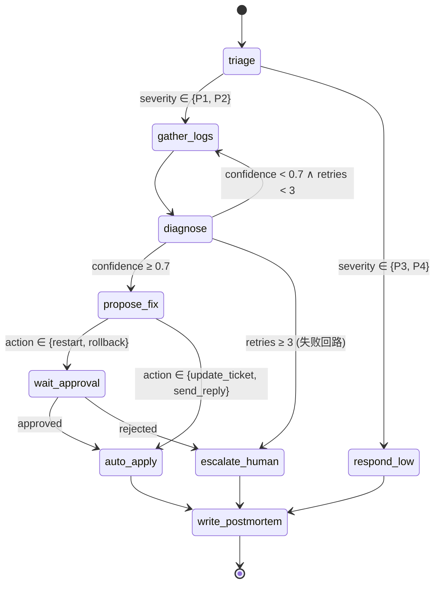
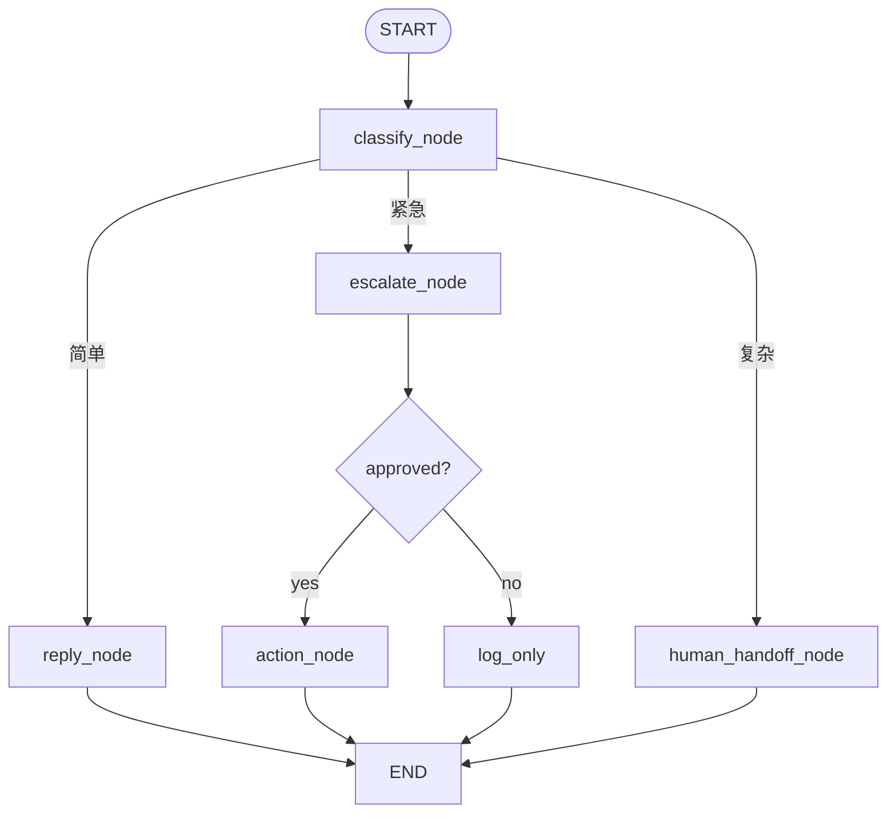

# 模块 5:高级架构与规划(L23–L27)讲师讲稿版

> 本模块解决"任务变复杂"问题:从 ReAct 升级到 Plan-Execute、Reflexion、Multi-Agent,并落到 LangGraph 状态机。

---

## L23 — Plan-and-Execute 模式

### 一、基本信息
- **课时编号**:L23
- **课时时长**:90 分钟
- **课型**:理论 + 伪代码
- **前置**:M2 + L5
- **教具**:Planner/Executor/Replanner 三节点架构图、对比 ReAct 的两个任务样本。

### 二、教学目标
**知识目标**
- 区分 ReAct 与 Plan-and-Execute 的本质差异与适用场景。
- 说出 Planner、Executor、Replanner 三个节点的职责。
- 解释为什么"没有 Replanner 的 Plan-Execute"是反模式。

**能力目标**
- 在伪代码层写出最小 Plan-Execute 循环。
- 给一个真实任务判断"该用 ReAct 还是 Plan-Execute"。

### 三、教学重点与难点
- **重点**:Replanner 的存在意义。
- **难点**:学员往往做出"硬塞计划"的实现,忽略 Replanner 兜底。

### 四、教学准备

**【环境 / 依赖】**
- 继承 M2/M4 环境:`openai + python-dotenv + pydantic`(pydantic 用于 plan schema 校验)。
- 讲师本地已跑通 3 版对比:ReAct 版 / Plan-Execute 版 / Plan-Execute+Replanner 版。

**【教学素材】**
- **2 个对比任务**(五.1 导入用,反复贯穿本课):
  - **任务 A(简单,ReAct 胜)**:"上海今天天气如何?" —— 1 步 tool 即可,Plan-Execute 反而慢/贵。
  - **任务 B(复杂,Plan-Execute 胜)**:"帮我策划一个 5 天日本关西 tech tour 行程,包含 3 家科技公司参访 + 每天餐厅推荐 + 交通" —— ReAct 常常做到一半失焦跳到别的城市;Plan-Execute 先拿完整计划再各步查询,一致性好得多。
  - **课上跑法**:两个任务分别用 ReAct 和 Plan-Execute 各跑一遍,看步数、token、成功率对比。

**【代码素材】**
- **Plan schema (Pydantic Model)**(五.2 板书):
  ```python
  class Step(BaseModel):
      id: int
      description: str
      tool: str | None
      depends_on: list[int] = []
      status: Literal["pending","done","failed"] = "pending"
      result: str | None = None
  class Plan(BaseModel):
      goal: str
      steps: list[Step]
  ```
- **`planner_agent.py`** 参考实现(约 120 行,含 Planner / Executor / Replanner 三节点)。
- **反面代码 `hard_plan.py`**:一次生成计划后无 Replanner,每步硬跑到底,一步失败全线崩 —— 用于演示"为什么需要 Replanner"。

**【数据 / 样例】**
- **Plan 输出样本**(讲师课前用 gpt-4.1 生成一份,课上直接展示):任务 B 大概 8-12 步的 JSON plan,含 depends_on 依赖关系。
- **步骤失败注入**:让"查东京饭店 tool"人为返 500,观察 Replanner 是否能改路径(如换城市或降级用户预期)。

**【教学材料】**
- **ReAct vs Plan-Execute 决策表**(五.3):
  | 维度 | ReAct 胜 | Plan-Execute 胜 |
  | ---- | ---- | ---- |
  | 步数 | ≤ 5 | > 10 |
  | 任务定义 | 探索式 | 明确 goal + subgoals |
  | 一致性 | 允许改主意 | 需全局一致 |
  | 成本敏感 | 中 | 高(前置 planner 值得) |
- **Replanner 3 触发条件**:step 失败 / 依赖变更 / 中途发现新信息颠覆假设。

**【学员课前】**
- 已用 ReAct 做过 M2 的多步任务,能感受"长任务会跑偏"。
- 想 1 个自己业务里"步数 > 8 且需要全局一致"的场景 —— L23 作业要为它设计 Plan-Execute。

**【备用方案】**
- 若 gpt-4.1 输出 plan 结构不稳(有时返回自由文本) → 讲师用 `response_format={"type":"json_schema", ...}` 强制结构化,防翻车。
- 若"任务 B 太长"跑现场 30 分钟出不来 → 缩到 3 天行程 + 1 家公司 + 1 家饭店,保住 15 分钟内看到 Plan-Execute 效果。

### 五、教学过程

#### 1. 导入:ReAct 在长任务下的痛(5 min)

**提问**:"如果让 Agent 做'生成季度财报',ReAct 还合适吗?"

> 【讲师讲稿】"ReAct 的本质是'走一步看一步'——每一步只想下一步做什么。这对短任务(3~5 步)非常好,但对长任务(>10 步)有两个问题:① **缺乏全局视角**,容易漏关键步骤;② **上下文持续累积**,十几步后 prompt 庞大、模型注意力涣散。**Plan-and-Execute** 是另一种范式:**先一次性规划,再分步执行,失败时重新规划**。今天我们就把它讲清楚。"

---

#### 2. 三节点架构精讲(20 min)

**架构图**:

```
   ┌─────────┐    ┌──────────┐    ┌──────────┐
   │ Planner │ ──▶│ Executor │ ──▶│Replanner │
   │ 一次规划 │    │ 逐步执行 │    │ 判断重规 │
   └─────────┘    └──────────┘    └────┬─────┘
                       ▲                │
                       │                │
                       └─── 继续 ◀──────┘
                       (失败/偏离时回 Planner 重规)
```

**三节点职责**:

**(1) Planner**
- 接收**用户目标**。
- 输出**有序步骤列表**(通常是 JSON list)。
- 每一步只描述"要做什么 + 期望产出",不绑死具体工具实现。

**Planner prompt 范式**:
```
你是规划专家。给定目标,输出最少必要步骤的 JSON 列表。
每一步格式:{"id": int, "desc": str, "expected_output": str}
目标:{goal}
```

输出例:
```json
[
  {"id": 1, "desc": "拉取本季度所有交易数据", "expected_output": "原始 CSV"},
  {"id": 2, "desc": "按部门聚合", "expected_output": "部门汇总表"},
  {"id": 3, "desc": "对比同期数据", "expected_output": "同比 / 环比表"},
  {"id": 4, "desc": "生成 Markdown 财报", "expected_output": "report.md"}
]
```

**(2) Executor**
- 接收**当前步骤**(由 plan 顺序给)。
- 用 ReAct 子循环执行这一步(调工具,跟 M2/M3 一样)。
- 输出 **observation**:这一步做完了什么,有什么意外。

**(3) Replanner**
- 接收 **当前 plan + 当前 step idx + 最新 observation**。
- 决策三选一:
  - **continue**:这一步 OK,执行下一步。
  - **replan**:出问题了,改写剩余步骤。
  - **done**:任务完成,输出 final answer。

**Replanner prompt 范式**:
```
当前计划:{plan}
当前进度:第 {idx} 步,刚刚结果:{observation}
请判断:
- 如果一切顺利,返回 {"decision":"continue"}
- 如果完成了,返回 {"decision":"done", "answer":"..."}
- 如果出现偏差,返回 {"decision":"replan", "new_plan":[...]}
```

> 【讲师讲稿】"Replanner 是 Plan-Execute 最容易被忽略也最重要的节点。**没有 Replanner,Plan-Execute 等于一锤子买卖**——一旦初始计划基于不充分信息(很常见),后续全错。Replanner 让这个范式真正可用。"

---

#### 3. 伪代码现场写(25 min)

讲师在白板从空开始写:

```python
def plan_execute(goal, max_replans=3, max_steps=20):
    plan = planner(goal)              # 一次性规划
    history = []                       # 累积 (step, observation)
    
    i = 0
    replans = 0
    
    while i < len(plan) and len(history) < max_steps:
        step = plan[i]
        obs = executor(step, history)  # 执行当前步
        history.append((step, obs))
        
        decision = replanner(plan, i, obs, history)
        
        if decision["decision"] == "done":
            return decision["answer"]
        
        if decision["decision"] == "replan":
            if replans >= max_replans:
                return "[max replans reached]"
            plan = decision["new_plan"]
            i = 0                       # 重新从头执行新计划(或从某个 idx)
            replans += 1
            continue
        
        # continue
        i += 1
    
    return finalize(history)
```

**逐行讲**:
- `planner(goal)`:**一次 LLM 调用**,得到完整 plan。
- `executor(step, history)`:执行单步,可能内部跑 ReAct 子循环。`history` 给 executor 让它知道之前发生了什么。
- `replanner(...)`:**关键决策点**,每步执行后必调。
- `max_replans`:限制重规次数,防止"反复重规死循环"。**一定要设**。
- `max_steps`:执行步数上限,跟 M2 的 `max_steps` 同理(同一概念,统一命名)。

> 【讲师讲稿】"注意两个 guardrail:`max_steps`(执行总步数)和 `max_replans`(重规次数)。它们都是必须的。`max_replans=3` 是经验值——重规 3 次还不收敛,通常是任务本身有问题,该升级到人工。"

---

#### 4. ReAct vs Plan-Execute 对比演示(20 min)

讲师跑两个任务:

**任务 A(简单,适合 ReAct)**:"北京天气怎么样?顺便算下 (12+8)*3。"
- ReAct:2 步搞定(`get_weather` + 心算或调 `mul`)。
- Plan-Execute:**过度设计**——规划阶段就要几次 LLM 调用,得不偿失。

**任务 B(复杂,适合 Plan-Execute)**:"读取本目录所有 .md 文件,提取每个文件的标题,生成一个目录索引,保存为 index.md。"
- ReAct:可能在第 5 步开始迷路(忘了已经读过哪些文件),也可能漏掉某些文件。
- Plan-Execute:规划阶段就明确"先列文件 → 逐个读 → 提取 → 生成索引",执行稳定。

> 【讲师讲稿】"**经验法则**:任务步数 ≤ 5 用 ReAct,任务有 5~15 步且子任务清晰用 Plan-Execute,> 15 步考虑 Multi-Agent(L25)。这个分界不是死规则,但能避免 80% 的过/欠设计。"

---

#### 5. 测查 + 小结(15 min)

**测查(10 min)**:
1. 投影第八节 3 道选择题,**学员举手抢答**(30 秒思考),公布答案后讲师针对每题陷阱**点 1~2 句**——尤其第 2 题"Replanner 是当前步偏离/失败时重规划剩余步骤"是 Plan-Execute 的容错灵魂,务必反复强调。
2. **简答 + 场景题**(第 4、5 题)分两组讨论 3 分钟,代表口头作答——场景题"调不存在的 X 工具"是 Plan-Execute 真实生产高频问题,讲师补漏"prompt 里限定 plan 只用现有工具"这种预防招式。

**小结(5 min)**:讲师投影 "今天必须带走的 3 句话":

> **今天必须带走的 3 句话**:
> 1. **Plan-Execute 与 ReAct 关键差异 = 是否一开始就生成整体计划**——Plan-Execute 适合步骤已知 / 模板驱动 / 信息充分;ReAct 适合环境不确定 / 边走边调。
> 2. **Replanner 是 Plan-Execute 的容错救命稻草**——任何一步偏离 / 失败 / 出现新信息,基于当前进度重新规划剩余;没 Replanner 等于一条道走到黑。
> 3. **经验分界**:≤ 5 步 ReAct,5~15 步 Plan-Execute,> 15 步考虑 Multi-Agent(L25)——80% 过/欠设计能避免。

> 【讲师讲稿】"今天讲的 Plan-Execute 是 ReAct 的'结构化升级版',下节课 L24 讲 Reflexion 是 ReAct 的'自我进化版'——同样基于 ReAct 主循环,但加上了'从失败中学习'的能力。回家挑一个 M2/M3 项目里的复杂任务,试着写一份 Plan-Execute 改造方案。"

#### 6. 作业(5 min)
- 在自己 Agent 上选 1 个真实任务,写一份 Plan-Execute 改造方案(不必实现,纯设计):列出 Plan 阶段输出的步骤、每步用什么工具、可能的失败点。

**参考答案(以"P1 客户工单根因调查"为例)**:

**任务**:客户工单"昨晚 22:00 起 API 报 502"→ 给出根因 + 解决建议 + 客户复盘文档。

**Plan(由 LLM 一次性生成)**:

```json
{
  "task": "调查 P1 工单 INC-2026-1234 的 502 根因并给出复盘",
  "steps": [
    {"step": 1, "action": "拉时间窗内的 API 错误日志",
     "tool": "grep_log", "args": {"start": "2026-06-08T22:00Z", "end": "2026-06-09T02:00Z", "pattern": "502|Bad Gateway"}},
    {"step": 2, "action": "查同时段 5xx 指标曲线", "depends_on": [1],
     "tool": "query_metrics", "args": {"metric": "http_5xx_rate", "window": "4h"}},
    {"step": 3, "action": "查同期是否有部署", "depends_on": [1],
     "tool": "get_recent_deploys", "args": {"service": "api-gateway", "since": "2026-06-08T20:00Z"}},
    {"step": 4, "action": "若 step 3 命中部署,查该部署的 diff", "depends_on": [3],
     "tool": "github_compare", "args": {"base": "{prev_sha}", "head": "{deploy_sha}"}},
    {"step": 5, "action": "整合 1+2+3+4 信息生成 200 字根因 + 5 条解决建议", "depends_on": [1,2,3,4],
     "tool": "llm_synthesize", "args": {"max_words": 300}}
  ]
}
```

**Executor**:按 `depends_on` 拓扑顺序执行;每步结果回填 state。

**可能的失败点 + Replanner 应对**:

| 失败点 | 表现 | Replan 策略 |
|---|---|---|
| `grep_log` 时间窗太宽返 50MB | tool 返 `ERROR: result too large` | 收紧时间窗到 30 分钟,分段调 |
| `query_metrics` 服务名错 | 返 `unknown service` | LLM 调 `list_services` 找正确名后重试 |
| 同期无部署(`step 3` 空) | step 4 没数据可对比 | 跳 step 4,在 step 5 prompt 中标注"非部署相关,推测网络/依赖" |
| step 5 LLM 输出超 300 字 | 验证失败 | replan 让 LLM 重新精简 |
| 全流程 ≥ 5 步后仍无明确根因 | success=False | 升级 → page_owner 并附 trace |

**评分维度**:
1. Plan 输出有**显式 schema**(JSON / 编号列表),不是散文段落;
2. 至少 4 步,且**有 ≥1 处步骤间依赖**(`depends_on`);
3. 列出 ≥3 个失败点 + 对应 Replan 策略(否则只是 happy path 不及格);
4. 步骤的 `tool` + `args` 是具体的(写 `tool: "查询"` 不行,要写 `tool: "query_metrics"`)。

### 六、板书设计
```
Planner ──▶ Executor ──▶ Replanner ──▶ continue / replan / done
                 ▲             │
                 └──── replan(重新规划剩余步骤)

适用:多步 + 有依赖 + 子任务清晰
guardrail:max_steps + max_replans(都必须设)
反模式:没有 Replanner = 一锤子买卖,初始计划错就全错
```

### 七、课堂练习(完整发放版)

> 讲师提示:本节练习让学员**为一个"长任务"设计 Plan schema + 手写 Planner/Executor/Replanner 三节点**。总时长 45-60 分钟。需 hello-agent 环境 + pydantic。

#### 练习 1:为"日本关西游 3 天行程"设计 Plan(20 min,3 人小组)

**任务**:用 pydantic Model 定义 Plan schema,让 planner 能输出结构化 JSON。

**要求**:
- Plan 含 goal + steps 列表
- Step 含 id / description / tool(可选) / depends_on(list of step id) / status / result
- 支持"某步依赖前几步的输出"(depends_on)
- Status 只能是 `pending / running / done / failed`

**参考答案**:
```python
from pydantic import BaseModel, Field
from typing import Literal

class Step(BaseModel):
    id: int
    description: str = Field(..., description="1 句话说明这一步要做什么")
    tool: str | None = Field(None, description="使用的 tool 名,None 表示纯思考步")
    depends_on: list[int] = Field(default_factory=list, description="依赖的 step id 列表")
    status: Literal["pending","running","done","failed"] = "pending"
    result: str | None = None

class Plan(BaseModel):
    goal: str
    steps: list[Step]
```

**手写一份 sample Plan(3 天关西游,填 8-12 步)**:
```json
{
  "goal": "3 天日本关西游,预算 1 万人民币",
  "steps": [
    {"id":1,"description":"查大阪机票日期","tool":"search_flights","depends_on":[]},
    {"id":2,"description":"根据机票日期定 3 天行程框架","tool":null,"depends_on":[1]},
    {"id":3,"description":"查京都必打卡景点 top 5","tool":"search_web","depends_on":[2]},
    {"id":4,"description":"查大阪美食推荐","tool":"search_web","depends_on":[2]},
    {"id":5,"description":"查奈良交通(大阪→奈良)","tool":"search_web","depends_on":[2]},
    {"id":6,"description":"综合估算总费用","tool":"calculator","depends_on":[3,4,5]},
    {"id":7,"description":"若超预算则简化第 3 天","tool":null,"depends_on":[6]},
    {"id":8,"description":"输出最终行程 markdown","tool":null,"depends_on":[7]}
  ]
}
```

**验收 checklist**:
- [ ] Pydantic Model 定义完整,可 `Plan.model_validate(json)` 通过
- [ ] Sample Plan ≥ 8 步
- [ ] 至少 2 步有 depends_on(体现依赖关系)
- [ ] 至少 1 步是纯思考(tool=None)

---

#### 练习 2:实现 Planner + Executor + Replanner 3 节点(30 min,个人)

**任务**:补全下面骨架,能跑通一次完整"日本关西游"任务。

**骨架代码 `plan_execute.py`**:
```python
import json
from openai import OpenAI
client = OpenAI()

PLANNER_SYSTEM = """
你是任务规划专家。给定用户目标,生成结构化 JSON plan。
输出必须严格符合下面 schema:
{"goal":"...","steps":[{"id":int,"description":"...","tool":"str|null","depends_on":[]}]}
"""

EXECUTOR_SYSTEM = """
你是任务执行者。给定当前 step + 前置步骤 result,输出该 step 的 result(字符串)。
"""

REPLANNER_SYSTEM = """
你是重规划者。给定原 plan + 已执行步骤结果 + 失败原因,输出新 plan(相同 schema)。
"""

def planner(goal: str) -> dict:
    """调 LLM 生成初始 plan"""
    resp = client.chat.completions.create(
        model="gpt-4.1",
        response_format={"type":"json_object"},
        messages=[{"role":"system","content":PLANNER_SYSTEM},{"role":"user","content":goal}],
    )
    return json.loads(resp.choices[0].message.content)

def executor(step: dict, prior_results: dict) -> str:
    """执行一步,可能调 tool 或纯 LLM 思考"""
    context = "\n".join(f"step {sid}: {r}" for sid, r in prior_results.items())
    resp = client.chat.completions.create(
        model="gpt-4.1",
        messages=[
            {"role":"system","content":EXECUTOR_SYSTEM},
            {"role":"user","content":f"目标:{step['description']}\n前置结果:\n{context}\n\n请给出这一步的结果(<200 字):"},
        ],
    )
    return resp.choices[0].message.content

def replanner(plan: dict, prior_results: dict, failed_step: dict, error: str) -> dict:
    """失败时重规划"""
    resp = client.chat.completions.create(
        model="gpt-4.1",
        response_format={"type":"json_object"},
        messages=[
            {"role":"system","content":REPLANNER_SYSTEM},
            {"role":"user","content":f"原 plan:\n{json.dumps(plan,ensure_ascii=False)}\n"
                                     f"已完成:\n{json.dumps(prior_results,ensure_ascii=False)}\n"
                                     f"失败 step:{failed_step['id']}\n错误:{error}\n"
                                     f"请生成新 plan(schema 同前):"},
        ],
    )
    return json.loads(resp.choices[0].message.content)

def run_plan_execute(goal: str, max_replan: int = 2) -> dict:
    plan = planner(goal)
    results = {}
    replan_count = 0
    while True:
        # 按 depends_on 找下一个可执行 step
        next_step = None
        for s in plan["steps"]:
            if s.get("status") == "done": continue
            if all(results.get(d) for d in s["depends_on"]):
                next_step = s
                break
        if next_step is None:
            break  # 全部 done
        try:
            r = executor(next_step, {d:results[d] for d in next_step["depends_on"]})
            next_step["status"] = "done"
            next_step["result"] = r
            results[next_step["id"]] = r
        except Exception as e:
            if replan_count >= max_replan:
                return {"status":"failed","plan":plan,"results":results,"error":str(e)}
            plan = replanner(plan, results, next_step, str(e))
            replan_count += 1
    return {"status":"success","plan":plan,"results":results}
```

**验收 checklist**:
- [ ] `run_plan_execute("3 天日本关西游 1 万人民币")` 能返回 `status:"success"`
- [ ] plan 里 ≥ 6 步,depends_on 至少出现 2 次
- [ ] 每一步的 result ≥ 50 字(不是空白)
- [ ] 故意让某个 executor 失败(如 mock raise),replanner 能生成新 plan 继续跑

**参考对比数据**(讲师课前跑好):
| 版本 | 总 LLM 调用次数 | 总耗时 | 一致性(是否偏题) |
| ---- | ---- | ---- | ---- |
| M2 ReAct | 15+ | 60s | 中(常常漏预算) |
| Plan-Execute | 12 | 40s | 高(全局一致) |

**常见坑**:
- 没有 `response_format={"type":"json_object"}` → LLM 输出自由文本,JSON parse 崩
- executor 没传前置 result → 每步独立瞎跑,失去依赖意义
- replanner 无限循环 → 必须有 `max_replan` 上限,3-5 次内不成功就返 failed
- depends_on 有环(A→B→A)→ 死循环;可加简单 topological sort 检查

**挑战延伸(选做)**:
- 加**并发执行**:所有依赖都 done 的 step 一次性 `asyncio.gather` 并跑
- 加**用户 approve** 环节:planner 出 plan 后暂停,等用户 y/n(为 M6 L29 铺垫)
- 加**执行历史 replay**:save plan + results 到 JSON,失败后可从 checkpoint 断点续跑

### 八、测查题与参考答案

1. Plan-Execute 与 ReAct 的关键差异是?  A. 是否使用工具  **B. 是否在开始时一次性生成整体计划——Plan-Execute 是,ReAct 是边想边做**  C. 是否带 reflection  D. 是否多 Agent → **B**。Plan-Execute 适合任务边界清楚、步骤稳定的场景;ReAct 适合环境不确定要边走边调。
2. Plan-Execute 中 Replanner 的作用是?  A. 在 Planner 之前预先优化 prompt  **B. 当某一步偏离 / 失败 / 出现新信息时,基于当前进度重新规划剩余步骤**  C. 收尾时检查任务完成度  D. 把 Plan 缓存起来供下次使用 → **B**。Replanner 是 Plan-Execute 的"容错救命稻草",不要 Replanner 等于一条道走到黑。
3. 任务"按公司格式模板生成季度财报"更适合哪种范式?  A. 纯 ReAct  **B. Plan-Execute(步骤已知、流程确定、模板驱动)**  C. Reflexion  D. Multi-Agent → **B**。流程确定的任务先 plan 后 execute 效率最高;ReAct 反而徒增"思考"开销。
4. **简答**:Plan-Execute 最大风险?
   - **参考答案**:初始计划基于不充分信息,易"南辕北辙";没 Replanner 兜底后续全错;复杂任务时规划本身可能不全面。
5. **场景**:第 3 步要求调不存在的 X 工具,怎么处理?
   - **参考答案**:① Executor 检测后写回"missing tool: X"作为 observation;② Replanner 基于"可用工具列表"重新规划剩余步骤;③ logs 告警,人工补工具或在 prompt 里限定 plan 只用现有工具。

### 九、教学反思要点
- 学员是否真理解 Replanner 的存在意义?可以让 2 人复述。
- 对比演示效果决定整节直观度,提前准备好两个任务的稳定脚本。

---

## L24 — Reflexion:自我反思与重试

### 一、基本信息
- **课时编号**:L24
- **课时时长**:90 分钟
- **课型**:理论 + 实操
- **前置**:L23
- **教具**:Reflexion 论文图、自评 prompt 模板、一个"故意需要 2~3 次反思才能答对"的任务。

### 二、教学目标
**知识目标**
- 解释 Reflexion(verbal RL)的核心机制:把反思笔记写回上下文驱动下一次推理。
- 区分 Reflexion 与简单 retry 的本质差异。

**能力目标**
- 写一段"评分 + 反思"的自评 prompt。
- 在 Agent 中实现"执行 → 自评 → 反思 → 重试"循环,带最大反思次数。

### 三、教学重点与难点
- **重点**:反思笔记必须**回填上下文**才有效。
- **难点**:防止陷入"反复反思类似内容"的死循环。

### 四、教学准备

**【环境 / 依赖】**
- 继承 L23 环境,无新增依赖。
- 讲师本地已跑通"Reflexion 版 Agent",能可重现地看到"第 1 轮失败 → 反思 → 第 2 轮成功"。

**【代码素材】**
- **自评 prompt 模板**(五.2 板书,3 段式):
  ```
  【任务】{goal}
  【上一次尝试】
  {last_attempt}
  【结果】{result}
  【自评规则】
  1. 上一次尝试是否达成任务?(y/n)
  2. 若 n,主要失败原因(≤ 3 条,具体到"哪一步、什么错")
  3. 下一次应改变什么(≤ 3 条,可执行的策略调整)
  【输出 JSON】{"success": bool, "reasons": [...], "revisions": [...]}
  ```
- **`reflexion_agent.py`** 参考实现,含 3 节点循环:Actor(执行)→ Evaluator(判定成败)→ Reflector(总结教训),下一轮 Actor prompt 内注入"过去教训"。
- **反面示例**:Reflexion 不设 `max_reflections=3`,让它无限反思同一件事(常见 anti-pattern),现场跑给学员看死循环。

**【数据 / 样例】**
- **稳定可重现的"需要反思"任务**(讲师课前挑选,确保第一次大概率失败):
  - 任务:"用 Python 写一个函数,输入一个正整数 n,返回第 n 个 happy number(欢乐数)"—— **技巧**:让模型不能查现成实现,只给 wikipedia 定义,首次实现常有边界 bug(如 4→死循环),迭代 1-2 次能修好。
  - 备用任务:"写 CSS 用 grid 做 3 列不规则布局,中间列宽 2 倍" —— 有明确视觉验收标准,失败可判定。
- **失败注入**:若模型第一次就写对,讲师故意把 unit test 加严一档,让它 fail 一次,才能演示 Reflexion 价值。

**【教学材料】**
- **Reflexion vs Retry 对比**(五.3):Retry = 完全相同 prompt 再来一次;Reflexion = **注入总结**再来一次。核心差在"是否学习"。
- **反思 3 陷阱**警示:
  1. **循环反思相同错误**:必须 `max_reflections=3` 硬止损
  2. **反思变胡编**:模型不知道真正错在哪,乱找理由 → 需要**可判定的 evaluator**(unit test / 结构化规则),不能只靠 LLM 主观打分
  3. **反思 prompt 太模糊**:"哪里错了" → 应改成"具体到哪一行 / 哪一步 / 哪个值"

**【学员课前】**
- 已理解 M2 L11 的 retry 与 backoff,今天要区分"retry vs reflect"的语义。
- 想 1 个自己业务里"第一次答不好但拿到反馈能改好"的任务 —— 作业用。

**【备用方案】**
- 若 happy number 任务模型一次就对(gpt-4.1 可能) → 换更绕的:"用递归写 Ackermann 函数,处理 (2,3),不允许溢出" —— 边界处理需要迭代。
- 若 evaluator 不好写(纯主观任务) → 换"输出 JSON schema 校验",Evaluator = Pydantic parse,失败即返 schema error,教学最清晰。

### 五、教学过程

#### 1. 导入:如果 Agent 失败,你会怎么做(5 min)

**提问**:"如果你的 Agent 跑完任务,结果错了,你会怎么处理?"

学员常见答案:① 重跑;② 改 prompt 再跑;③ 看 trace 然后改代码。

> 【讲师讲稿】"今天要讲的是第四种:**让 Agent 自己反思失败原因,把'下次注意'写下来,带着这份反思再跑一次**。这就是 2023 年 Shinn 等人提出的 Reflexion(直译'反思')。它的本质是把传统强化学习里的'奖励信号'换成了'语言反思',所以也叫 verbal RL。"

---

#### 2. Reflexion 循环精讲(20 min)

**核心流程**:

```
attempt 1: try task → answer1 → evaluate(answer1) → score1
                                ↓
                              reflect:"下次注意 X"
                                ↓
attempt 2: try task(带上"下次注意 X" 的上下文)→ answer2 → ...
```

**与简单 retry 的区别**:

| | 简单 retry | Reflexion |
|---|---|---|
| 失败后 | 完全相同输入再来一次 | **带着"上次为什么失败" 再来一次** |
| 关键机制 | 偶然性 | 反思笔记**进入上下文** |
| 适用 | 偶发抖动(网络) | 推理/规划错误 |

> 【讲师讲稿】"区别的关键在'**反思笔记是否真的进入下一次的 prompt**'。如果只是 LLM 自言自语,然后下次不带,等于零;如果反思被作为新的 system 注释附加到下一次 prompt 里,LLM 才能'学到教训'。**这是 Reflexion 的精髓**。"

---

#### 3. 自评 prompt 工程(20 min)

**模板**:

```
你是严格的评审员,评价以下 Agent 任务的执行:

# 任务
{task}

# Agent 的执行轨迹
{trace}

# Agent 的最终回答
{answer}

# 评估标准
1. 是否真的完成了任务?
2. 中间步骤是否高效/正确?
3. 有没有幻觉或事实错误?

请输出 JSON:
{
  "score": <0-10 整数>,
  "passed": <bool>,
  "lesson": "<不超过 100 字的'下次注意'笔记,要具体可操作>"
}
```

**注意点**:
- **lesson 必须具体可操作**——避免"下次要更仔细"这种空话,要"下次先调 X 工具确认 Y 字段"。
- 评分用整数而非自然语言("好/中/差"),便于程序化判断阈值。
- 用 `response_format=json_schema` 强约束输出(L32 详讲)。

**学员现场改写**:讲师给一个空模板,让学员针对自己业务改 5 分钟。讲师挑 2 份点评。

---

#### 4. 接入 Agent 实操(25 min)

```python
def try_with_reflection(task, max_reflect=4):
    """统一返回 (answer, attempts, status)
       status = "ok" | "max_reflect_reached"
    """
    lessons = []   # 累积的反思笔记
    answer = None
    
    for attempt in range(max_reflect):
        # 把反思加到 system
        system = BASE_SYSTEM
        if lessons:
            system += "\n\n## 过去尝试的教训(请避免)\n"
            for i, l in enumerate(lessons, 1):
                system += f"{i}. {l}\n"
        
        # 跑 Agent
        answer, trace = run_agent_with_trace(task, system=system)
        
        # 自评
        review = evaluate(task, trace, answer)
        if review["passed"]:
            return answer, attempt + 1, "ok"     # 成功
        
        # 失败,记下反思
        lessons.append(review["lesson"])
    
    return answer, max_reflect, "max_reflect_reached"
```

**关键细节**:
- 反思**累积**:每次失败的 lesson 都加进去,后续尝试看到所有过去教训。
- **max_reflect** 一定要有(经验值 3~5),避免无限反思死循环。
- 用 embedding 比对历次 lesson 是否高度重复(余弦相似度 > 0.9),如果是,说明 Agent "鬼打墙",直接放弃。

> 【讲师讲稿】"Reflexion 不是万灵药——如果根本问题在工具坏了 / 数据缺失,反思一万次也没用。所以**适用范围是'推理/规划错误'**,不是'底层资源错误'。出错前先排除资源问题,再考虑 Reflexion。"

---

#### 5. 测查 + 小结(15 min)

**测查(10 min)**:
1. 投影第八节 3 道选择题,**学员举手抢答**(30 秒思考),公布答案后讲师针对每题陷阱**点 1~2 句**——尤其第 2 题"Reflexion vs retry 差别在是否带反思上下文"是 90% 学员的盲点。
2. **简答 + 场景题**(第 4、5 题)分两组讨论 3 分钟,代表口头作答——场景题"跑 5 轮还失败"考查"何时停止 Reflexion 升级到人工"的工程判断。

**小结(5 min)**:讲师投影 "今天必须带走的 3 句话":

> **今天必须带走的 3 句话**:
> 1. **Reflexion = 失败后生成反思 lessons,带教训重试**——核心机制是"把反思笔记写回上下文驱动下一次推理",不是简单"再试一次"。
> 2. **Reflexion ≠ retry**:retry 适合瞬时故障(429 / 网络);Reflexion 适合推理 / 规划错误——两者机制不同,不能混用,选错只会浪费 token 不解决问题。
> 3. **不要用 Reflexion 解决资源问题**——工具坏 / 数据缺失,反思一万次也没用;适用范围是"推理 / 规划错误",出错先排除底层资源。

> 【讲师讲稿】"今天讲的 Reflexion 是 Agent 自我进化的雏形——失败 → 反思 → 改进,这是高阶 Agent 的核心能力之一。回家挑一个 M2/M3 里失败的 case,用 Reflexion 改造,看 3 次尝试 + 各自 lesson 的 trace,你会真实感受到'第 2 次比第 1 次明显更好'的进化感。"

#### 6. 作业(5 min)
- 用 Reflexion 改造自己 M2/M3 项目里的 1 个失败 case,提交"3 次尝试 + 各自 lesson"的 trace。

**参考答案(代码骨架 + sample trace)**:

```python
SYSTEM_BASE = "你是一名 SQL 助手,根据自然语言生成 PostgreSQL 查询。"

def try_attempt(user_q: str, lessons: list[str]) -> tuple[str, bool, str]:
    """跑一次尝试,返回 (sql, ok, error_or_explanation)."""
    system = SYSTEM_BASE
    if lessons:
        system += "\n\n以下是过往尝试的教训,务必避免重蹈:\n" + \
                  "\n".join(f"- {l}" for l in lessons)
    resp = client.chat.completions.create(
        model=MODEL,
        messages=[{"role":"system","content":system},
                  {"role":"user","content":user_q}],
    )
    sql = resp.choices[0].message.content.strip()
    try:
        rows = db.execute(sql).fetchall()                  # 真跑一下
        return sql, True, f"成功:{len(rows)} 行"
    except Exception as e:
        return sql, False, f"{type(e).__name__}: {e}"

def reflect(user_q: str, sql: str, error: str) -> str:
    """让 LLM 反思——把错误 → 一句教训."""
    resp = client.chat.completions.create(
        model=MODEL,
        messages=[
            {"role":"system","content":"你是一名 code reviewer。把刚才的失败 → 一句不超过 30 字的'下次该怎么做'教训。"},
            {"role":"user","content":f"问题: {user_q}\nSQL: {sql}\n错误: {error}"},
        ],
    )
    return resp.choices[0].message.content.strip()

def reflexion_solve(user_q: str, max_attempts: int = 3) -> dict:
    lessons = []
    history = []
    for i in range(max_attempts):
        sql, ok, msg = try_attempt(user_q, lessons)
        history.append({"attempt": i+1, "sql": sql, "ok": ok, "msg": msg, "lessons_in": list(lessons)})
        if ok:
            return {"success": True, "answer_sql": sql, "history": history}
        lesson = reflect(user_q, sql, msg)
        lessons.append(lesson)
        history.append({"attempt": i+1, "lesson_out": lesson})
    return {"success": False, "history": history}

# 跑一个真实 fail case
result = reflexion_solve("找出 2025 年消费最多的 5 个客户")
import json
print(json.dumps(result, ensure_ascii=False, indent=2))
```

**Sample trace**(常见演化路径):

```jsonc
{
  "success": true,
  "answer_sql": "SELECT customer_id, SUM(amount) AS total FROM orders WHERE order_date BETWEEN '2025-01-01' AND '2025-12-31' GROUP BY customer_id ORDER BY total DESC LIMIT 5;",
  "history": [
    {
      "attempt": 1,
      "sql": "SELECT customer_id, SUM(amount) FROM orders WHERE YEAR(order_date)=2025 ORDER BY 2 DESC LIMIT 5;",
      "ok": false,
      "msg": "UndefinedFunction: function year(date) does not exist"        // ❌ MySQL 函数,PG 没有
    },
    { "attempt": 1, "lesson_out": "PG 用 EXTRACT(year FROM x) 或日期区间,不用 YEAR()" },

    {
      "attempt": 2,
      "sql": "SELECT customer_id, SUM(amount) FROM orders WHERE EXTRACT(year FROM order_date)=2025 ORDER BY 2 DESC LIMIT 5;",
      "ok": false,
      "msg": "GroupingError: column 'orders.customer_id' must appear in GROUP BY"     // ❌ 漏 GROUP BY
    },
    { "attempt": 2, "lesson_out": "聚合查询里非聚合列必须出现在 GROUP BY 子句" },

    {
      "attempt": 3,
      "sql": "SELECT customer_id, SUM(amount) AS total FROM orders WHERE order_date BETWEEN '2025-01-01' AND '2025-12-31' GROUP BY customer_id ORDER BY total DESC LIMIT 5;",
      "ok": true,
      "msg": "成功:5 行"      // ✅ 第 3 次成功
    }
  ]
}
```

**评分要点**:
1. 真实**跑通验证**(`try_attempt` 不能只检查语法,要真执行),否则 reflexion 失去意义;
2. `reflect` 输出 ≤ 30 字一句话,**积累 ≤ 3~5 条**(否则 system prompt 膨胀);
3. trace 完整(每次尝试的 sql + ok + lesson 都打印),便于复盘;
4. 至少 2 次失败 + 1 次成功的演化路径(全成功说明 case 太简单,全失败说明 reflect 没起作用);
5. **生产警告**:Reflexion 在 SQL/代码/数学这类**有客观对错**的任务上效果好;在"写营销文案"这类主观任务上效果有限。

### 六、板书设计
```
attempt 1 → evaluate → reflect("lesson 1") → 加进 system
attempt 2 → evaluate → reflect("lesson 2") → 加进 system
...

vs retry:retry 是相同输入再来;Reflexion 是带反思上下文再来

退出条件:passed=True / max_reflect / lessons 高度重复

适用:推理/规划错误
不适用:工具坏 / 数据缺(先修底层)
```

### 七、课堂练习(完整发放版)

> 讲师提示:本节练习是"给一个失败任务加 Reflexion 循环"。学员基于 M2 hello-agent 环境,总时长 40-50 分钟。

#### 练习 1:写一个"能失败"的任务 + evaluator(15 min,个人)

**任务**:准备一个可判定的任务(即可写 pass/fail 判断),用于后续 Reflexion 演示。

**推荐任务**:实现"happy number"函数
- 定义:一个数字如果反复"各位数平方求和"最终等于 1 就是 happy number
- 例:19 → 1²+9² = 82 → 8²+2² = 68 → 6²+8² = 100 → 1+0+0 = 1 ✓
- 反例:4 → 16 → 37 → 58 → 89 → 145 → 42 → 20 → 4 ...(循环) ✗

**Evaluator**(客观判定,不依赖 LLM):
```python
def eval_happy_number(fn) -> tuple[bool, str]:
    """返 (是否 pass, 错误说明)"""
    cases = [(1, True), (7, True), (19, True), (4, False), (23, True), (2, False)]
    for n, expected in cases:
        try:
            result = fn(n)
        except Exception as e:
            return False, f"crash on n={n}: {e}"
        if result != expected:
            return False, f"n={n} expected {expected} got {result}"
    return True, "all cases passed"
```

**验收 checklist**:
- [ ] `eval_happy_number(<正确实现>)` 返 `(True, "all cases passed")`
- [ ] `eval_happy_number(<错误实现>)` 返 `(False, ...)` 明确指出哪个 case 挂
- [ ] 至少 6 个测试 case,覆盖正/反例 + 循环陷阱(如 4)

---

#### 练习 2:实现 Reflexion 循环(25 min,个人)

**任务**:让 Agent **写 happy_number 函数 → evaluator 判 → 若 fail 反思 → 迭代**,最多 3 轮。

**骨架代码**:
```python
import inspect
from openai import OpenAI
client = OpenAI()

ACTOR_SYSTEM = """
你是 Python 工程师。根据用户需求 + (可选)过去尝试的教训,
写一个完整的 Python 函数(不含 test 代码,只函数本体)。
输出格式:直接给代码块,不要 markdown 标记,不要解释。
"""

REFLECTOR_SYSTEM = """
你是代码 review 专家。给定:任务 + 上次实现 + 测试失败信息,
分析原因,提炼 <= 3 条可执行的改进建议(具体到哪一行、什么改法)。
输出格式:JSON {"reasons":[...],"revisions":[...]}
"""

def actor(task: str, past_lessons: list[str]) -> str:
    lessons_str = "\n".join(f"- {l}" for l in past_lessons) if past_lessons else "(无过去尝试)"
    resp = client.chat.completions.create(
        model="gpt-4.1",
        messages=[
            {"role":"system","content":ACTOR_SYSTEM},
            {"role":"user","content":f"任务:{task}\n\n过去教训:\n{lessons_str}\n\n请写代码:"},
        ],
    )
    code = resp.choices[0].message.content.strip()
    # 简单清理:去掉 ```python ... ``` 包装
    if code.startswith("```"):
        code = "\n".join(code.split("\n")[1:-1])
    return code

def reflector(task, last_code, eval_result) -> dict:
    resp = client.chat.completions.create(
        model="gpt-4.1",
        response_format={"type":"json_object"},
        messages=[
            {"role":"system","content":REFLECTOR_SYSTEM},
            {"role":"user","content":f"任务:{task}\n\n上次代码:\n{last_code}\n\n测试失败:{eval_result}\n\n请给出 JSON:"},
        ],
    )
    return json.loads(resp.choices[0].message.content)

def run_reflexion(task, evaluator, max_reflections=3):
    lessons = []
    for attempt in range(max_reflections + 1):
        code = actor(task, lessons)
        print(f"\n=== Attempt {attempt+1} ===\n{code}\n")

        # 动态执行代码取出目标函数
        ns = {}
        exec(code, ns)
        fn = next((v for v in ns.values() if callable(v) and not v.__name__.startswith("_")), None)
        if fn is None:
            lessons.append("上次没有定义任何函数,请务必用 `def happy(n):` 形式")
            continue

        ok, msg = evaluator(fn)
        print(f"Eval: {'PASS' if ok else 'FAIL'} - {msg}")
        if ok:
            return {"status":"success","attempt":attempt+1,"code":code}

        # 反思
        reflect = reflector(task, code, msg)
        for rev in reflect["revisions"]:
            lessons.append(rev)
    return {"status":"failed","last_code":code,"last_error":msg,"lessons":lessons}

# ====== 使用 ======
result = run_reflexion(
    task="写一个函数 happy(n:int)->bool 判断 n 是否是 happy number。注意处理循环退出条件。",
    evaluator=eval_happy_number,
    max_reflections=3,
)
print(result)
```

**验收 checklist**:
- [ ] 首次 attempt 有较高概率失败(gpt-4.1 常常忘循环处理 → n=4 死循环或错答)
- [ ] Reflector 输出结构化 JSON,能被 parse
- [ ] 第 2-3 次 attempt 能 pass
- [ ] `max_reflections=3` 兜底生效,即使不成功也返 `status:"failed"` 不 crash
- [ ] 每次 attempt 打印当前代码 + eval 结果 + 反思教训(便于观察循环)

**参考正确答案(happy_number)**:
```python
def happy(n: int) -> bool:
    seen = set()
    while n != 1 and n not in seen:
        seen.add(n)
        n = sum(int(d)**2 for d in str(n))
    return n == 1
```

---

#### 练习 3:Reflexion 反面案例分析(10 min,个人)

**任务**:讨论 Reflexion 的 3 个失效场景,给每个想一个规避方案。

**场景**:

| # | 失效场景 | 症状 | 你的规避方案 |
| - | -------- | ---- | ---- |
| A | 反复反思同一个错误 | 3 轮下来教训列表大同小异 | |
| B | 反思变成"编理由"(不知道真错在哪) | reasons 字段乱说 | |
| C | Evaluator 太主观(用 LLM-Judge)导致 pass 但实际错 | 骗过评委 | |

**参考答案**:

| # | 规避方案 |
| - | ---- |
| A | (1) `max_reflections` 硬止损;(2) 若 3 轮教训相似度 > 0.8,直接返 failed 不再试 |
| B | (1) 用 **可判定的 evaluator**(不是 LLM 打分,是 unit test);(2) 反思 prompt 明确要求 "定位到具体行 + 具体错误值",拒绝抽象反思 |
| C | (1) LLM-Judge 用**不同厂商** model 判(避免自评偏袒);(2) 抽 10% pass case 人工复核;(3) 结构化 rubric,每条打分明确 1-5 档 |

**验收**:
- [ ] 3 个规避方案都具体可实施(不是"再看看")
- [ ] 至少 1 个方案是"用工程手段代替 LLM 判断"(工程 > LLM 直觉)

**挑战延伸(选做)**:
- 让 Reflexion 支持 **多个候选** actor(温度 0.8 生成 3 版)+ evaluator 挑最好的一版进入反思
- 把 reflection 的 "教训" 写入 ChromaDB 作为长期记忆,下次遇到相似任务自动召回(接 M4 L21)

### 八、测查题与参考答案

1. Reflexion 的核心机制是?  A. 多个 Agent 互相讨论  **B. Agent 失败 / 不满意结果后,生成"反思笔记(lessons)",把它写回上下文驱动下一次推理**  C. 用更强的模型重跑  D. 调高 temperature → **B**。Reflexion = 自我反思 + 把反思变成新 prompt;不是"再试一次",是"带着教训再试一次"。
2. Reflexion 与普通 retry 的根本区别在?  **A. retry 只是重跑(可能犯同样错),Reflexion 把上一次的反思上下文带入了下一次推理**  B. retry 必须改 prompt,Reflexion 不用  C. retry 只能跑一次  D. 没区别 → **A**。retry 适合瞬时故障(429/网络);Reflexion 适合"答错了、推理错了"这类需要从错误中学的场景。
3. Reflexion 何时**不适用**?  A. 多步任务 + 高质量要求  **B. 单步成本极低 / 失败代价小 / 直接 retry 更简单的场景(Reflexion 自反思本身要钱要时间)**  C. 创意写作  D. 长上下文任务 → **B**。Reflexion 适合"质量 >> 成本"的场景(如代码生成、复杂推理),廉价任务别用。
4. **简答**:写一段自评 prompt 模板。
   - **参考答案(可直接套用)**:
     ```
     You are a strict evaluator. Read the user's question, the AI's answer, and
     decide if the answer is correct, complete, and grounded.

     Output JSON ONLY:
     {
       "score":    1 | 2 | 3 | 4 | 5,        // 1=完全错, 5=完美
       "ok":       true | false,             // score >= 4 视为 ok
       "issues":   ["短句描述问题1", "短句描述问题2"],
       "lesson":   "一句话告诉自己下次该怎么做(≤30 字)"
     }

     Rules:
     - 如果答案含未在 tool_results 出现的事实,score ≤ 2(幻觉)。
     - 如果答案漏掉了用户提的某个子问题,score ≤ 3。
     - 如果答案完全正确且全部 grounded,score = 5。

     ---
     User question:    {user_q}
     AI answer:        {ai_answer}
     Tool results:     {tool_results_summary}
     ```
   - **要点**:① 强制 JSON 输出(便于程序解析);② `lesson` 字段≤30 字(防 system prompt 膨胀);③ 显式规则(幻觉/遗漏/grounded)避免模型主观打分;④ score+ok 双字段(score 给细粒度评估,ok 给后续 if/else 用)。
5. **场景**:跑 5 轮还失败,怎么办?
   - **参考答案**:① 升级人工或更强模型;② 用 embedding 检查 lessons 是否高度重复(说明陷入循环);③ 如果是工具/数据问题,先修底层再跑;④ 拆任务降复杂度;⑤ 加入更详细的 few-shot 示例引导。

### 九、教学反思要点
- 第 2 次比第 1 次"明显更好"的演示是否成功?如果没有,准备稳定可重现的 demo 任务。
- 学员是否真理解"反思必须写回 prompt 才有效"?这是核心。

---

## L25 — Multi-Agent 多智能体协作

### 一、基本信息
- **课时编号**:L25
- **课时时长**:90 分钟
- **课型**:理论 + 讨论
- **前置**:L23、L24
- **教具**:4 种拓扑结构图、典型案例卡片(必要/边缘/不必要 各 1)。

### 二、教学目标
**知识目标**
- 列出 4 种 Multi-Agent 拓扑:Orchestrator-Worker / Hierarchical / Debate / Handoff。
- 解释每种拓扑的代价(上下文复制、协议设计、根因定位)。

**能力目标**
- 给定一个需求,判断"是否需要 Multi-Agent"。
- 能反驳"上来就 5 个 Agent"的过度设计。

### 三、教学重点与难点
- **重点**:克制冲动——大多数任务不需要 Multi-Agent。
- **难点**:拓扑选择没有"标准答案",需要工程权衡。

### 四、教学准备

**【教学素材】**
- **4 张拓扑图**(A5 打印或投影,五.3 讲):
  1. **Star / Orchestrator**:1 个 leader 调度多个 worker(常用于任务分派)
  2. **Chain**:A → B → C(流水线,如 planner → executor → reviewer)
  3. **Debate**:2-3 个 Agent 就一个议题辩论,由裁判 Agent 合成(用于观点多样性)
  4. **Swarm / Peer**:多 Agent 平等,共享 blackboard(用于探索性任务)
- **3 张案例卡**(必要 / 边缘 / 完全不必要):
  - **必要**:"起草一份 10 页市场分析报告 —— 需要行业分析师 + 财务分析师 + 写手 + 校对 4 个角色" → 单 Agent 上下文会爆,分工是必然。
  - **边缘**:"写个函数 + 测试" —— 可以拆开发/测试两 Agent,但一个 Agent 用不同 prompt 段落也能做,多 Agent 收益不明显。
  - **完全不必要**:"查天气" —— 一个 Agent 一个 tool 就够,任何分工都是过度设计。

**【代码素材】**
- **多 Agent 最小示例**(五.4 讲):基于 LangGraph 的 3 节点(researcher / writer / reviewer),每个是一个独立 subgraph。约 60 行。
- **反面示例 `overkill.py`**:8 个 Agent 做"查天气"任务,把简单事情做复杂,耗时 20s、成本 $0.5。
- **通信 pattern 示例 2 种**:
  1. **消息传递**:Agent A `send(B, msg)` (LangGraph `Command` / `Send` API)
  2. **共享 state**:多个 Agent 读写同一 blackboard(state dict 里的 `notes` 字段)

**【数据 / 样例】**
- **拓扑决策 checklist**(五.5):
  - 单 Agent 上下文能不能装得下?装得下 → 单 Agent
  - 任务是否天然分工(不同角色专业不同)?是 → 考虑 Star/Chain
  - 需要观点多样性/对抗?是 → Debate
  - 探索空间大且并行搜索有价值?是 → Swarm
- **成本对比表**样例:
  | 拓扑 | 3 步任务 tokens | 15 步任务 tokens |
  | ---- | ---- | ---- |
  | 单 Agent | 3k | 15k |
  | Star(3 worker) | 5k(调度开销) | 12k(并行摊薄) |
  | Debate(3 debater) | 9k | 45k(几乎不划算) |

**【教学材料】**
- **反直觉金句**(五.1 导入):"更多 Agent ≠ 更聪明,常常是更慢、更贵、更难调试。" —— 反抗"堆 Agent"的团队本能。
- **Coordinator 必要性**:任何多 Agent 拓扑都需要一个"谁说了算 / 何时结束"的角色,否则会永远互相 ping。

**【学员课前】**
- 已理解 L23 Plan-Execute(单 Agent 内的分工) 和 L24 Reflexion(单 Agent 迭代)。今天把"分工"从 prompt 层升级到 Agent 层。
- 想 1 个自己团队里"其实用单 Agent 就够却被硬拆成多 Agent"或"反过来"的场景 —— 讨论用。

**【备用方案】**
- 若课上没时间跑 LangGraph 完整 demo → 讲师用 3 段 Python 类 mock 3 个 Agent(每个是一个 `def`),用共享 state 演示消息传递,同样能讲清 pattern。
- 若讨论 3 张案例卡意见完全一致(团队水平高)→ 加 2 张"边缘中的边缘"case:"写个 15 步的 CRUD API" —— 争议点在"角色差异是否够大到值得拆"。

### 五、教学过程

#### 1. 导入:为什么 5 个 Agent 不一定比 1 个 Agent 强(5 min)

> 【讲师讲稿】"很多团队听到'Multi-Agent'就兴奋——好像 5 个 Agent 就能干 5 倍的事。**事实恰恰相反**:Multi-Agent 在大多数任务里**效果更差、更贵、更难调试**。今天要把 Multi-Agent 的适用边界讲清楚,以及它的隐性成本。"

---

#### 2. 四种拓扑精讲(25 min)

##### 2.1 Orchestrator-Worker(总管派活)

```
        ┌──────────────┐
        │ Orchestrator │  ← 接收用户请求,分解任务
        └──────┬───────┘
        ┌─────┼─────┐
        ▼     ▼     ▼
     Worker Worker Worker  ← 各自专精领域
     (BD)   (技术) (法律)
```

**典型场景**:客服分诊(根据问题类型路由到不同专业 Agent)。

**特点**:层级清晰,Orchestrator 只做"分发 + 汇总"。

##### 2.2 Hierarchical(多层级)

```
   CEO Agent
   ├── PM Agent
   │   ├── Dev Agent 1
   │   └── Dev Agent 2
   └── QA Agent
       └── Test Runner
```

**典型场景**:大型项目模拟、复杂代码生成系统。

**特点**:每层只关注一个粒度,Top-down 分解。

##### 2.3 Debate(辩论)

```
   Question
      │
      ├─▶ Agent A(立场 1)
      ├─▶ Agent B(立场 2)
      └─▶ Agent C(立场 3)
            │
            ▼
        Aggregator(综合)
```

**典型场景**:复杂推理(数学竞赛、伦理判断)、决策评审。

**特点**:多个 Agent 提出不同视角再综合,提升正确率。

##### 2.4 Handoff(显式移交)

```
   Agent A ──(handoff)──▶ Agent B ──(handoff)──▶ Agent C
   "你来吧"             "我接手"             "完成"
```

**典型场景**:OpenAI Agents SDK 的 handoff、客服转接专家、复杂工单流转。

**特点**:控制权在一条主线上传递,而不是并行。

> 【讲师讲稿】"这 4 种不是互斥的——一个复杂系统可能同时用 Hierarchical + Handoff。但**在你引入第二个 Agent 之前,请先问'单个 Agent + 多个 prompt 模板能不能做'**。这是模块 1 反复强调的'够用就好'原则。"

---

#### 3. 隐性成本(20 min)

讲师列出 Multi-Agent 的 4 大隐性成本:

**(1) 上下文复制**

每个 Agent 都得了解任务背景。原本 1 个 system prompt(500 tokens),变成 5 个 Agent 各自 system(2500 tokens)。**Token 翻 5 倍**。

**(2) 协议设计与测试**

Agent A 输出什么格式给 Agent B?B 怎么解析?消息丢失/格式错怎么办?**这是新的工程问题**,等于多了一套微服务通信。

**(3) 根因定位困难**

最终结果错了,是 Agent A 错、B 错、还是它俩配合错?Trace 要看 5 条线,**调试成本指数上升**。

**(4) 总 token / 时延上升**

5 个 Agent 顺序执行 = 5 倍时延;并行执行 = 5 倍 token。总成本上升,质量未必上升。

> 【讲师讲稿】"我做过统计:**60% 的 Multi-Agent 项目,如果换成单 Agent + 精心设计的 prompt,效果一样甚至更好,成本下降 70%**。所以选 Multi-Agent 之前,务必先做这个对照实验。"

---

#### 4. 案例研讨(25 min)

**【活动】** 3 张卡片小组讨论:

**卡片 1**(必要):**"做一个研究平台:用户给一个主题,先去网上搜文献(研究员),再让一个 Agent 写综述(写手),另一个 Agent 校对事实(校对)。"**
- 三角色职责清晰、可独立产出可验证结果(文献清单、初稿、校对意见)。
- **建议 Multi-Agent**:Orchestrator + 3 Worker。

**卡片 2**(边缘):**"做一个客服 Agent:能查订单、能查物流、能退款、能升级到人工。"**
- 看起来 4 件事,但**本质都是'客服'这一个角色**,只是用不同工具。
- **建议**:单 Agent + 4 个工具。除非你想清晰隔离权限(退款必须人工审批),才考虑拆 Agent。

**卡片 3**(不必要):**"做一个写作助手,既能润色文章,又能改语法,又能翻译。"**
- 三件事都是"文本生成"同一类任务。
- **建议**:单 Agent + 3 个 prompt 模板(或 3 个 Tool)。拆 Agent 纯过度设计。

> 【讲师讲稿】"判断标准只有一个:**角色职责是否真的不同,且每个角色的输出能独立验证**。能,就 Multi-Agent;不能,就单 Agent。"

---

#### 5. 测查 + 小结(10 min)

**测查(7 min)**:投影第八节 3 道选择题,**学员举手抢答**(30 秒思考),公布答案后讲师针对每题陷阱**点 1~2 句**——尤其第 1 题"Monolithic 不是 Multi-Agent 拓扑"提醒学员"单体不是落后,是合理选择"。简答与场景题分两组讨论 2 分钟,代表口头作答。

**小结(3 min)**:讲师投影 "今天必须带走的 3 句话":

> **今天必须带走的 3 句话**:
> 1. **优先单 Agent,不轻易上 Multi-Agent**——隐性成本(上下文复制 / 协议设计 / 根因定位 / 故障面扩大 / token 翻倍)非常大,**Monolithic 不可耻**,是合理选择。
> 2. **Multi-Agent 三大拓扑**:Orchestrator-Worker(主管 + 执行者) / Hierarchical(层级嵌套) / Peer-Handoff(平级移交)——按场景选,不要堆叠。
> 3. **判断标准只有一个**:角色职责是否**真的不同**,且每个角色的输出能**独立验证**——能,Multi-Agent;不能,单 Agent + 多 prompt 即可。

> 【讲师讲稿】"今天讲的 Multi-Agent 是 Agent 工程化的'放大器'——用对了能并行处理复杂业务,用错了把简单事情搞成跨团队项目。L26 我们用 LangGraph 把这些复杂结构(Plan-Execute、Reflexion、Multi-Agent)真正落到代码里,你会看到状态图怎么把这些抽象表达得清清楚楚。"

#### 6. 作业(5 min)
- 在自己业务找一个"伪 Multi-Agent 需求",写一段为什么单 Agent 就够的论证。

**参考答案(范例 + 评分维度)**:

> **伪 Multi-Agent 需求**:"我们要做一个'代码评审'功能。需求方说要 3 个 Agent:'安全 Agent'查 SQL 注入/XSS,'风格 Agent'查命名/缩进,'性能 Agent'查 N+1 查询/大循环。最后由一个 Coordinator 汇总。"
>
> **为什么单 Agent 就够**(4 点论证):
>
> 1. **无并发收益**:这三类检查都是**对同一份 diff 的不同视角**,不像"并行查 3 个城市天气"那样独立 IO 密集。3 个 Agent 串行 LLM 调用与 1 个 Agent 用 1 次 prompt 同时考察三方面,**LLM 总 token 量几乎一样**(可能更多——3 个 system prompt × 3 倍重复 diff 上下文)。
> 2. **协作开销大于收益**:Coordinator 需要把 3 个 Agent 的输出合并、去重、排优先级——这本身又是一次 LLM 调用,引入额外的合并幻觉风险(如 3 个 Agent 都报"行 42 命名不规范",Coordinator 可能合并成 1 条也可能保留 3 条,行为不稳)。
> 3. **debug 困难**:出问题时不知道是"安全 Agent 漏报"还是"Coordinator 合并丢了"。单 Agent 一次 trace 就能定位。
> 4. **维护成本**:3 个 Agent 各自的 prompt / model 选型 / 异常处理都要维护,代码量 ~3 倍,bug 面积 ~3 倍。
>
> **正解**:用**单 Agent + 一个结构化 system prompt**:
>
> ```
> You are a senior code reviewer. Analyze the diff from THREE perspectives in ONE pass:
> 1. Security: SQL injection, XSS, unsafe deserialization, hardcoded secrets
> 2. Style: naming (snake_case), indentation, line length
> 3. Performance: N+1 queries, large loops, missing indexes
> Output a JSON list: [{"severity":"high|med|low", "category":"sec|style|perf", "line":N, "msg":...}]
> ```
>
> 一次 LLM 调用,结构化输出,可直接渲染到 UI。**只有当 3 类检查需要调不同工具集(如安全要调静态扫描器 semgrep、性能要跑 EXPLAIN)且工具调用模式差异巨大时,才考虑 Multi-Agent**。

**何时才真的需要 Multi-Agent**(4 个真实 trigger):
1. 各 Agent **背景知识 / system prompt 差异极大**(如"医疗专家 vs 法律专家"会诊);
2. 各 Agent 用**不同模型**(如 GPT-4 做创意,Claude 做写作,Gemini 做翻译);
3. 各 Agent **需独立 long-running**(如"创意 Agent"工作 10 分钟,"市调 Agent"工作 30 分钟,需异步并发);
4. 业务上要求**职责审计可分离**(法务 Agent 决策被监管必须独立可审计)。

**评分维度**(每项 2.5 分,共 10 分):
1. 给出**具体**伪 Multi-Agent 需求(不能"在做的项目"这种模糊);
2. 至少 3 条"单 Agent 就够"的论证,且**含定量**(token 量、调用次数等);
3. 提供"正解 prompt"或单 Agent 替代方案;
4. 同时指出"什么时候才真的要 Multi-Agent"——体现你不是反 Multi-Agent,而是反"为用而用"。

### 六、板书设计
```
四拓扑
  Orchestrator-Worker   总管 + 专家 worker(客服分诊)
  Hierarchical          多层级(大型项目)
  Debate                多视角辩论(复杂推理)
  Handoff               显式移交(OpenAI Agents SDK)

隐性成本
  上下文复制 / 协议设计 / 根因定位 / token+时延

原则
  单 Agent + 多 prompt 模板能解决,就不要 Multi-Agent
  60% 的 Multi-Agent 项目能被单 Agent 替代
```

### 七、课堂练习(完整发放版)

> 讲师提示:本节练习是**判断力训练**,不写代码。总时长 30 分钟,分小组讨论 + 全班展示。

#### 练习 1:8 张场景卡做拓扑选型(20 min,3 人小组)

**任务**:每张卡给出 (选择拓扑 / 理由 / 反选警示)。

**8 张场景卡**:

| # | 场景 | 选择 | 理由 | 反选警示 |
| - | ---- | ---- | ---- | ---- |
| A | 查询"天气 + 时间"给用户 | | | |
| B | 客服工单分派 + 分级 + 4 类问题需要不同专家(账单/技术/法务/退款) | | | |
| C | 起草 30 页市场分析报告(数据分析师 + 财务 + 战略 + 写手 + 校对 5 人分工) | | | |
| D | 学术辩论 Bot:给一个议题,支持方 vs 反方各写 500 字,再让裁判合成结论 | | | |
| E | 探索式数据挖掘:多个 Agent 从不同角度并行分析同份数据,发现最有价值的 insight | | | |
| F | 单元测试自动生成:输入函数,输出测试用例 | | | |
| G | 长文档翻译:每段并行翻译再汇总 | | | |
| H | 多轮 chatbot,记住用户上下文即可 | | | |

**参考答案**:

| # | 选择 | 理由 | 反选警示 |
| - | ---- | ---- | ---- |
| A | **单 Agent** | 2 步任务无分工必要 | 不选 Star:调度开销>业务收益 |
| B | **Star(Orchestrator + 4 专家)** | 天然按 domain 分工,orchestrator 分派 | 不选 Chain:分类不清难以线性排 |
| C | **Chain(A→B→C→D→E)** 或混合 | 分析师→数据→战略→写→校 是线性流水线 | 不选 Swarm:多角色平等会话协作 → 上下文混乱 |
| D | **Debate**(2 debater + 1 judge) | 对抗结构天然适合观点多样性 | 不选单 Agent:自说自话不够严谨 |
| E | **Swarm** | 探索式无固定流程,鼓励发散 | 不选 Chain:线性会限制发现路径 |
| F | **单 Agent** | 1 步任务,tool 用 pytest 即可 | 不选多 Agent:无分工空间 |
| G | **Fan-out/Fan-in**(实现上是 Star 变种) | 每段并行独立,汇总合并 | 不选 Debate:翻译无对抗 |
| H | **单 Agent** | 状态就是 messages,无角色区分 | 不选任何多 Agent:纯浪费 |

**验收 checklist**:
- [ ] 8 张都填齐 3 列
- [ ] 至少 6 张答对
- [ ] 反选警示不能是"我不懂",必须是拓扑选错的具体后果

**常见误判**:
- 看 A 也想上 Star("多 Agent 显得高端") → 反直觉:**更少 Agent 通常更好**
- 看 F 想上 Chain(1 个"生成"1 个"评审") → 一个 Agent 用双 prompt 就够
- 看 C 想上 Swarm(觉得平等更好) → **报告有明确流水线依赖,Chain 才对**

---

#### 练习 2:估算隐性成本(10 min,个人)

**任务**:估算下面 3 种拓扑跑同一任务("总结 10 篇产品评测")的成本对比。

**假设**:
- 单 Agent 版:一次读 10 篇 + 一次写摘要 = ~ 20k in + 2k out
- Star 版:1 orchestrator + 3 workers(各读 3-4 篇),再汇总 = ~ 40k in + 5k out(有调度重复)
- Debate 版:3 debater + 1 judge,每人读全 10 篇再互相 review = ~ 100k in + 10k out

**用 GPT-4.1 定价**(in $2.5/1M, out $10/1M):

| 拓扑 | in tokens | out tokens | 单次成本 | 100 次/天成本 |
| ---- | ---- | ---- | ---- | ---- |
| 单 Agent | 20k | 2k | | |
| Star | 40k | 5k | | |
| Debate | 100k | 10k | | |

**参考答案**:

| 拓扑 | 单次 | 100 次/天 |
| ---- | ---- | ---- |
| 单 Agent | 20k×2.5+2k×10 = $0.07 | $7/天 |
| Star | 40k×2.5+5k×10 = $0.15 | $15/天 |
| Debate | 100k×2.5+10k×10 = $0.35 | $35/天 |

**结论**:
- Debate 版是单 Agent 版 **5 倍成本**;必须证明 5 倍质量提升才值
- 大多数场景单 Agent 就够,别为了"多样性"上 Debate

**挑战延伸(选做)**:
- 加入 latency 维度:哪个拓扑最快?(通常 Star 并行最快,单 Agent 中,Debate 最慢因为串行辩论)
- 加入 debug 复杂度:出错后哪个最难查?(Swarm > Debate > Star > 单 Agent)

### 八、测查题与参考答案

1. 下列哪个**不是** Multi-Agent 的常见拓扑?  A. Orchestrator-Worker(主管 + 多个执行者)  B. Hierarchical(层级,可多级嵌套)  C. Peer / Handoff(平级移交)  **D. Monolithic(单体——这是反义词,等于不是 Multi-Agent)** → **D**。Monolithic 就是"单一大 Agent",和 Multi-Agent 对立。
2. 什么时候应该**优先选择**单 Agent 而不是 Multi-Agent?  **A. 任务步数少、角色不分化、上下文共享负担可接受时**  B. 永远优先 Multi-Agent,系统更先进  C. 团队规模 > 5 人时  D. 任务 token 超 100K 时 → **A**。Multi-Agent 引入协议设计/上下文复制/根因定位等隐性成本,能不上就不上。
3. 在 OpenAI Agents SDK / handoff 模式里,"handoff" 指?  **A. 一个 Agent 把任务移交给另一个 Agent 继续处理(可带摘要,可带上下文)**  B. 把对话移交给人工客服  C. 把 LLM 调用切换到另一个模型  D. 把会话存到另一个数据库 → **A**。handoff 是去中心化协作的典型实现——Agent 之间像接力棒一样传任务。
4. **简答**:Multi-Agent 最大隐性成本?
   - **参考答案**:① 上下文复制(每 Agent 都要背景);② 协议设计/测试;③ 根因定位难;④ token/时延上升;⑤ 故障面扩大。
5. **场景**:"代码评审 + 安全审计 + 性能分析" 要不要 Multi-Agent?
   - **参考答案**:看任务边界。三件事职责清晰且能独立产出报告 → 3 角色 + 1 Orchestrator 合并报告;否则单 Agent + 3 prompt 模板足够。一般建议先用单 Agent 跑一遍看效果,不够再拆。

### 九、教学反思要点
- 学员是否还是"想上就上"?可以让他们对照"隐性成本表"自评自己的项目。

---

## L26 — LangGraph 入门:用状态图描述 Agent

### 一、基本信息
- **课时编号**:L26
- **课时时长**:120 分钟(实战)
- **课型**:实操
- **前置**:L23、L25
- **教具**:`pip install langgraph langchain-openai`、官方 hello world 备份。

### 二、教学目标
**知识目标**
- 解释 `StateGraph`、`add_node`、`add_edge`、`add_conditional_edges` 的作用。
- 理解节点函数返回值的"局部更新"语义(自动 merge)。

**能力目标**
- 跑通 LangGraph 官方 hello world。
- 用 LangGraph 实现 L23 的 Plan-Execute 最小版本。

### 三、教学重点与难点
- **重点**:状态图思维 + 条件边。
- **难点**:节点返回"部分字段"而非完整 state,与传统编程习惯不同。

### 四、教学准备

**【环境 / 依赖】**
- **必装**:`pip install langgraph langchain-openai langchain-community`(langgraph ≥ 0.2.30 更稳)。
- 或替代:`pip install langgraph langchain-anthropic` / `langchain-ollama`(用本地模型)。
- **端到端验证**(讲师课前必跑):`python -c "from langgraph.graph import StateGraph; print('ok')"`。
- **可选**:`pip install grandalf` 让 `graph.get_graph().draw_mermaid()` 更好看。

**【代码素材】**
- **官方 hello world 备份**(防离线,五.2 直接跑):最小 3 节点 StateGraph,含 `TypedDict` 状态、`add_node` / `add_edge` / `set_entry_point` / `compile`。约 30 行,课上一步步敲。
- **完整 ReAct 版 `L26_react_lg.py`**:用 LangGraph 重写 M2 L9 的 ReAct loop,对比手写版看到"状态显式化"的好处。
- **`add_conditional_edges` 示例**:决策函数返回 "tools" / "end",演示分支路由。
- **可视化 demo**:`app.get_graph().draw_mermaid_png("graph.png")`,课上让学员生成自己的状态图当作业交付物。

**【数据 / 样例】**
- **State 字段建议清单**(五.3 板书):
  ```
  messages: list[BaseMessage]      # 复用 langchain 消息类型
  next: str | None                 # 下个节点名(可选)
  step_count: int                  # 用于 max_steps 熔断
  cost: float                      # 累计 tokens
  errors: list[str]                # 错误累积,便于 replan 参考
  ```
- **常见节点/边错误**清单:
  1. 节点返回**完整 state** 而非 partial dict → 会覆盖同名字段(应只返变更字段)
  2. 循环没设 `add_conditional_edges` 出口 → 无限循环
  3. 忘 `compile()` 就调用 → AttributeError
  4. `TypedDict` 用 `list` 类型没加 `Annotated[list, operator.add]` → 每次替换而非追加

**【教学材料】**
- **状态图 3 要素**板书:**Node**(纯函数,in state → out partial state)/ **Edge**(直连或条件)/ **State**(TypedDict 或 Pydantic)。
- **对比表**:手写 for 循环 vs LangGraph 状态图,后者的 4 优势:可视化 / checkpoint / HITL 中断 / 时间旅行(rewind)。
- **partial state 更新规则**:节点返回的 dict 里,**只有出现的 key 会被更新**,未出现的保留原值 —— 这与 React setState 类似。

**【学员课前】**
- 已用手写方式写过 Agent 主循环(M2)。
- 阅读 [LangGraph Quickstart](https://langchain-ai.github.io/langgraph/tutorials/introduction/) 前 5 段,建立"状态机+节点"的心智。

**【备用方案】**
- 若 langgraph pip 装不上 → 用 conda 或 pipx,或降级到 `langgraph==0.1.x`(API 略有差异,讲师课前对照)。
- 若离线环境完全不能装 → 用**手写状态机**替代:自定义 `nodes = {name: fn}` + `edges = [(from, cond, to)]` + `run(state)` 循环,约 30 行,同样能讲清状态图心智,LangGraph 只是"更漂亮的封装"。

### 五、教学过程

#### 1. 导入:为什么需要 LangGraph(5 min)

> 【讲师讲稿】"L4 我们手写主循环,L9/L12 把它打磨可用。L23 的 Plan-Execute 涉及多个节点 + 条件分支,如果继续手写 if/else,代码会迅速变得难以维护。LangGraph 提供的抽象是'**把 Agent 的流程画成状态图**',节点是函数,边是条件。今天我们看看它怎么让复杂 Agent 变简单。"

---

#### 2. 核心概念精讲(20 min)

##### 2.1 State(状态)

LangGraph 把 Agent 的所有上下文统一为一个 `State`(通常是 TypedDict 或 dataclass):

```python
from typing import TypedDict
from langgraph.graph import StateGraph, END

class PlanExecuteState(TypedDict):
    task: str
    plan: list[str]
    step_idx: int
    history: list[str]
    answer: str
    finished: bool
```

**关键**:State 是**整个图共享的"白板"**,每个节点读它、写它的某些字段。

##### 2.2 Node(节点)

节点是普通 Python 函数,签名 `(state) -> dict_of_updates`:

```python
def plan_node(state: PlanExecuteState) -> dict:
    plan = llm_plan(state["task"])
    return {"plan": plan, "step_idx": 0}   # ← 只返回要更新的字段
```

**关键**:**节点返回的不是新 state,而是要 merge 进 state 的字段**。框架自动 merge。

##### 2.3 Edge(边)

- **普通边**:`g.add_edge("a", "b")` → 从节点 a 直接到 b。
- **条件边**:`g.add_conditional_edges("a", router_fn, mapping)` → router_fn 读 state 返回字符串,字符串映射到下一节点。

```python
def route(state):
    if state["finished"]: return "end"
    if state["step_idx"] >= len(state["plan"]): return "end"
    return "loop"

g.add_conditional_edges("execute", route, {
    "end": END,
    "loop": "execute",
})
```

##### 2.4 编译与执行

```python
app = g.compile()
result = app.invoke({"task": "..."})   # 同步
# 或 async: result = await app.ainvoke(...)
# 或流式: for ev in app.stream(...): ...
```

> 【讲师讲稿】"LangGraph 把 'Agent 是什么' 抽象成 'State 在节点间流动'。这种抽象的好处是**可视化(自动生成 mermaid)、可恢复(checkpoint 持久化 state)、可暂停(interrupt_before 实现 HITL)**。后面 L29 我们用它做 HITL 就是基于这套能力。"

---

#### 3. Hello World 实操(30 min)

讲师从空文件开始,写最小图:

```python
from typing import TypedDict
from langgraph.graph import StateGraph, END

class State(TypedDict):
    n: int

def increment(state):
    print(f"increment: {state['n']} -> {state['n'] + 1}")
    return {"n": state["n"] + 1}

def is_done(state):
    return "end" if state["n"] >= 5 else "loop"

g = StateGraph(State)
g.add_node("inc", increment)
g.set_entry_point("inc")
g.add_conditional_edges("inc", is_done, {"loop": "inc", "end": END})

app = g.compile()
result = app.invoke({"n": 0})
print("Final:", result)
```

**学员跟练 15 分钟**:跑通这个 5 步递增的例子;在节点里加 print 观察 state 变化;尝试改成"递减到 0"。

---

#### 4. Plan-Execute 状态图实现(45 min)

讲师把 L23 的伪代码翻成 LangGraph:

```python
class PlanExecuteState(TypedDict):
    task: str
    plan: list[str]
    step_idx: int
    history: list[str]
    answer: str
    finished: bool
    replans: int

def plan_node(state):
    plan = llm_plan(state["task"])   # 用 LLM 生成 plan(略)
    return {"plan": plan, "step_idx": 0, "history": [], "replans": 0}

def execute_node(state):
    step = state["plan"][state["step_idx"]]
    obs = llm_execute(step, state["history"])
    return {"history": state["history"] + [(step, obs)]}

def replan_node(state):
    decision = llm_replan(state)
    if decision["decision"] == "done":
        return {"finished": True, "answer": decision["answer"]}
    if decision["decision"] == "replan":
        return {"plan": decision["new_plan"], "step_idx": 0,
                "replans": state["replans"] + 1}
    # continue
    return {"step_idx": state["step_idx"] + 1}

def route_after_replan(state):
    if state["finished"]:                              return "end"
    if state["replans"] >= 3:                          return "end"
    if state["step_idx"] >= len(state["plan"]):        return "end"
    return "execute"

g = StateGraph(PlanExecuteState)
g.add_node("plan",    plan_node)
g.add_node("execute", execute_node)
g.add_node("replan",  replan_node)
g.set_entry_point("plan")
g.add_edge("plan",    "execute")
g.add_edge("execute", "replan")
g.add_conditional_edges("replan", route_after_replan,
    {"execute": "execute", "end": END})

app = g.compile()
result = app.invoke({"task": "..."})
```

**学员独立完成 30 分钟**,讲师答疑常见问题:
- 忘 `set_entry_point` → 不知道从哪开始。
- 节点返回 `None` → 框架不知道更新什么。
- 条件路由的 mapping 没覆盖所有可能返回 → 报错。

---

#### 5. 测查 + 小结(15 min)

**测查(10 min)**:
1. 投影第八节 3 道选择题,**学员举手抢答**(30 秒思考),公布答案后讲师针对每题陷阱**点 1~2 句**——尤其第 3 题"节点返回 partial update"是新手"返回完整 state"的常见错误源,务必让大家在自己代码里检查。
2. **简答 + 场景题**(第 4、5 题)分两组讨论 3 分钟,代表口头作答——场景题"失败时回到 plan 节点"是真实 LangGraph 项目高频需求,讲师把 `add_conditional_edges` + router 函数的标准写法在白板上画一遍。

**小结(5 min)**:讲师投影 "今天必须带走的 3 句话":

> **今天必须带走的 3 句话**:
> 1. **LangGraph = StateGraph 状态机**——节点是函数(可副作用),边是条件,共享 state;支持循环 / 分支 / checkpoint / HITL,是复杂 Agent 的工业级框架。
> 2. **节点返回 partial update**(只返回想更新的字段子集),LangGraph 自动 merge——简洁且并发安全,配合 reducer 还能合并多节点写。
> 3. **三大杀手锏**:① mermaid 可视化;② checkpoint 持久化(SqliteSaver / MemorySaver);③ `interrupt_before` 实现 HITL 暂停-恢复——这是 LangGraph 比手写 Agent 强在"工程化全栈"的核心三件。

> 【讲师讲稿】"今天上手了 LangGraph,下节课 L27 我们把'状态图设计'这件事讲透——什么时候拆子图、什么时候并发、什么时候用 BPM 而不是状态图。状态图思维是 Agent 工程师从'写代码'升级到'画系统'的关键跃迁。"

#### 6. 作业(5 min)
- 给 Plan-Execute 状态图增加一条"执行失败时回 plan 重新规划"的边,测试 Replanner 行为。

**参考答案**:

```python
import sqlite3
from typing import TypedDict
from langgraph.graph import StateGraph, END
from langgraph.checkpoint.sqlite import SqliteSaver

class PlanExecuteState(TypedDict):
    task:          str
    plan:          list[str]
    cur_step:      int
    last_result:   str
    last_error:    str           # ← 新增:执行失败时填,Replanner 读
    replan_count:  int           # ← 新增:防死循环
    final_answer:  str

MAX_REPLAN = 3                   # ← 关键:limit 重规划次数,防 Plan↔Execute 死循环

def planner(state):
    """从任务(或失败原因)出发,生成一个 plan."""
    if state.get("last_error"):
        prompt = (f"任务: {state['task']}\n"
                  f"上次失败: {state['last_error']}\n"
                  f"已完成步骤: {state['plan'][:state['cur_step']]}\n"
                  f"请重新规划【剩余】步骤(避免重蹈失败).")
    else:
        prompt = f"任务: {state['task']}\n请输出 3~5 步 plan (JSON list of strings)."
    plan_json = call_llm(prompt)                    # 简化
    return {"plan": parse_steps(plan_json),
            "cur_step": 0,
            "last_error": "",
            "replan_count": state.get("replan_count", 0)}

def executor(state):
    step = state["plan"][state["cur_step"]]
    try:
        result = run_step(step)                     # 真跑 / 调工具
        return {"last_result": result,
                "cur_step": state["cur_step"] + 1,
                "last_error": ""}
    except Exception as e:
        return {"last_error": f"step '{step}' failed: {type(e).__name__}: {e}"}

def route_after_execute(state) -> str:
    """关键:根据 executor 的输出决定下一步."""
    if state.get("last_error"):
        if state["replan_count"] >= MAX_REPLAN:
            return "give_up"
        return "replan"                              # ← 失败 → 回 Planner
    if state["cur_step"] >= len(state["plan"]):
        return "done"
    return "execute"                                 # 继续下一步

def replanner_trigger(state):
    """什么也不做的中间节点,只是把 replan_count 加 1."""
    return {"replan_count": state["replan_count"] + 1}

def synthesizer(state):
    return {"final_answer": f"完成: {state['last_result']}"}

def give_up_node(state):
    return {"final_answer": f"已重规划 {MAX_REPLAN} 次仍失败, 放弃. 最后错误: {state['last_error']}"}

g = StateGraph(PlanExecuteState)
g.add_node("plan",    planner)
g.add_node("execute", executor)
g.add_node("replan_tick", replanner_trigger)
g.add_node("synth",   synthesizer)
g.add_node("give_up", give_up_node)
g.set_entry_point("plan")
g.add_edge("plan",         "execute")
g.add_edge("replan_tick",  "plan")                   # ← 新增的"失败回 plan"边
g.add_edge("synth",         END)
g.add_edge("give_up",       END)
g.add_conditional_edges(
    "execute",
    route_after_execute,
    {"execute": "execute", "replan": "replan_tick", "done": "synth", "give_up": "give_up"},
)

conn = sqlite3.connect("plan_exec.db", check_same_thread=False)
app  = g.compile(checkpointer=SqliteSaver(conn))

# 测试:让第 2 步必失败,看 replanner 是否被触发
result = app.invoke(
    {"task": "查询并汇总 2025 营收 top 5", "plan": [], "cur_step": 0,
     "last_result": "", "last_error": "", "replan_count": 0, "final_answer": ""},
    config={"configurable": {"thread_id": "test-replan-1"}},
)
print(result["final_answer"])
```

**验证 Replanner 触发**:在 LangSmith trace 或本地打印中,你应看到:

```
plan          → ["查 orders", "EXTRACT year", "ORDER BY total LIMIT 5"]
execute (1)   → OK
execute (2)   → ERROR: function YEAR() does not exist
replan_tick   → replan_count = 1
plan          → ["查 orders", "改用 EXTRACT(year FROM ...)", "GROUP BY", "ORDER BY"]
execute (1)   → OK
...
synth         → final_answer
```

**评分要点**:
1. 新增的 `last_error` / `replan_count` **必须在 State schema 里声明**(否则 LangGraph 会拒绝写入);
2. `route_after_execute` 必须覆盖**4 种返回**(continue/replan/done/give_up),漏一个会卡死;
3. **必须有 `MAX_REPLAN` 限制**(否则 plan↔execute 互踢死循环,烧钱);
4. trace 里能清楚看到 "失败 → replan → 新 plan" 链路(否则不算验证 Replanner 真触发);
5. `replan_tick` 这种"什么都不做只加计数"的中间节点是 LangGraph 常见模式——直接 `execute → plan` 也行,但显式节点便于打 metric。

### 六、板书设计
```
State ─── 共享白板,所有节点读写
Node  ─── (state) -> dict_of_updates(自动 merge)
Edge  ─── add_edge / add_conditional_edges

g = StateGraph(State)
g.add_node("a", fn_a)
g.add_node("b", fn_b)
g.set_entry_point("a")
g.add_edge("a", "b")
g.add_conditional_edges("b", router, {...})
app = g.compile()
app.invoke(init_state)

收益:可视化 / checkpoint / HITL / 与 LangSmith 集成
```

### 七、课堂练习(完整发放版)

> 讲师提示:本节练习让学员**用 LangGraph 手写 Hello World 状态图,再实现一个 Plan-Execute 状态图**。学员机需 `pip install langgraph langchain-openai`,推荐 langgraph ≥ 0.2.30。总时长 60-75 分钟。

#### 练习 1:LangGraph Hello World(20 min,个人)

**任务**:实现一个最小 3 节点状态图,展示 State / Node / Edge / compile 全流程。

**要求**:
- 状态含 `messages`(累积) + `step_count`
- 3 个节点:input_node(接收用户输入) → process_node(转大写 + step_count += 1) → output_node(打印)
- 显式 add_edge 3 条

**骨架代码**:
```python
from typing import TypedDict, Annotated
from langgraph.graph import StateGraph, START, END
import operator

class State(TypedDict):
    messages: Annotated[list[str], operator.add]     # add 是自定义合并规则
    step_count: int

def input_node(state: State) -> dict:
    return {"messages":["INPUT: " + state["messages"][-1] if state["messages"] else "hello"]}

def process_node(state: State) -> dict:
    last = state["messages"][-1] if state["messages"] else ""
    return {"messages":[last.upper()], "step_count": state.get("step_count",0) + 1}

def output_node(state: State) -> dict:
    print("FINAL:", state["messages"][-1], "steps=", state["step_count"])
    return {}

builder = StateGraph(State)
builder.add_node("input", input_node)
builder.add_node("process", process_node)
builder.add_node("output", output_node)
builder.add_edge(START, "input")
builder.add_edge("input", "process")
builder.add_edge("process", "output")
builder.add_edge("output", END)

app = builder.compile()

result = app.invoke({"messages":["hi from student"], "step_count":0})
print(result)
```

**验收 checklist**:
- [ ] 代码能跑,最终打印 `FINAL: INPUT: HI FROM STUDENT` 或类似
- [ ] `step_count=1`(process_node 加了 1 次)
- [ ] `messages` 列表有 3 条(初始 + input_node + process_node)
- [ ] 会用 `Annotated[list, operator.add]` 让 list 是**追加**而非替换
- [ ] `app.get_graph().draw_mermaid()` 能输出 mermaid 图源码

---

#### 练习 2:Plan-Execute 状态图(40 min,个人)

**任务**:用 LangGraph 重写 L23 的 Plan-Execute,把 planner / executor / replanner 变成 3 个节点。

**架构**:
```
      START → planner → executor →(有更多待办?)
                          │
                          └→ replanner ─┐(某步失败)
                                        │
                          ↓             │
              (全部 done?)              │
                          │             │
                          └───→ END     │
                                        │
                          ←─────────────┘
```

**骨架代码**:
```python
from typing import TypedDict, Annotated, Literal
from langgraph.graph import StateGraph, START, END
import operator, json
from openai import OpenAI
client = OpenAI()

class PlanState(TypedDict):
    goal: str
    plan: dict                       # {goal, steps:[{id,description,tool,depends_on,status,result}]}
    results: dict                    # {step_id: result_str}
    error: str | None
    replan_count: int
    final_answer: str | None

def planner_node(state: PlanState) -> dict:
    prompt = f"生成 JSON plan,goal={state['goal']},schema=..."
    # TODO
    resp = client.chat.completions.create(...)
    plan = json.loads(resp.choices[0].message.content)
    return {"plan": plan, "replan_count": state.get("replan_count",0)}

def executor_node(state: PlanState) -> dict:
    plan = state["plan"]
    results = state.get("results",{})
    # 找下一个可执行 step
    for s in plan["steps"]:
        if s.get("status") == "done": continue
        if all(results.get(d) for d in s["depends_on"]):
            # TODO:执行这一步,填 results,更新 status
            try:
                r = execute_step(s, results)
                s["status"] = "done"
                s["result"] = r
                return {"plan": plan, "results": {**results, s["id"]: r}}
            except Exception as e:
                return {"plan": plan, "error": str(e), "results": results}
    # 全部 done
    return {"final_answer": _summarize(plan, results)}

def replanner_node(state: PlanState) -> dict:
    # 参考 L23,基于 error 生成新 plan
    ...
    return {"plan": new_plan, "error": None, "replan_count": state["replan_count"]+1}

def route_after_executor(state: PlanState) -> Literal["executor","replanner","end"]:
    if state.get("final_answer"): return "end"
    if state.get("error"):
        if state["replan_count"] >= 3:
            return "end"
        return "replanner"
    return "executor"

# 构图
builder = StateGraph(PlanState)
builder.add_node("planner", planner_node)
builder.add_node("executor", executor_node)
builder.add_node("replanner", replanner_node)
builder.add_edge(START, "planner")
builder.add_edge("planner", "executor")
builder.add_conditional_edges("executor", route_after_executor, {
    "executor": "executor",
    "replanner": "replanner",
    "end": END,
})
builder.add_edge("replanner", "executor")
app = builder.compile()
```

**验收 checklist**:
- [ ] `app.invoke({"goal":"3 天日本关西游 1 万人民币","results":{}})` 能返回含 final_answer 的 state
- [ ] 至少 6 步执行
- [ ] 故意让某 step 抛异常,replanner 被路由到,replan_count 递增
- [ ] `replan_count > 3` 触发 END 不死循环
- [ ] `app.get_graph().draw_mermaid_png("plan_exec.png")` 生成状态图片

**常见坑**:
- Node 返回**完整 State** 而不是 **partial dict**:覆盖同名字段(应只返变更字段)
- `Annotated[list, operator.add]` 忘加:list 每次替换而非追加,history 丢失
- 循环边没设 `add_conditional_edges` 出口:无限循环
- `results` 字段不用 Annotated 只是普通 dict,合并规则可能出问题;用 `{**old, **new}` 手动合并

**参考答案**:见本课作业参考答案 M5 L26 完整版。

**挑战延伸(选做)**:
- 加入 **checkpointing**(`langgraph.checkpoint.memory.MemorySaver` 或 `SqliteSaver`),Ctrl+C 后能从最后状态恢复
- 加入 **HITL interrupt**:`interrupt_before=["replanner"]`,replan 前需人工审批(为 M6 L29 铺垫)
- 用 `app.stream(...)` 观察每个节点的实时输出

### 八、测查题与参考答案

1. LangGraph 最核心的抽象是?  A. Chain(链式调用)  **B. StateGraph(状态图 / 状态机:节点是函数,边是条件,共享 state)**  C. Pipeline  D. DAG(有向无环图,LangGraph 支持有环) → **B**。LangGraph 用状态机思维表达 Agent 流程,天然支持循环、分支、checkpoint。
2. `add_conditional_edges` 的作用是?  A. 添加一条无条件边  **B. 根据 router 函数返回值(基于当前 state)决定下一个节点是哪个**  C. 添加多个并行边  D. 设置节点超时 → **B**。这是 LangGraph 表达"决策分支"的关键 API:router(state) → 节点名。
3. LangGraph 节点函数的返回值规范是?  A. 完整 state(必须返回所有字段)  **B. 只返回这个节点想要更新的字段子集,LangGraph 自动 merge 进 state**  C. 必须 `return None`  D. 返回字符串描述结果 → **B**。partial update 让节点写起来简洁、并发安全(配合 reducer 还能合并多节点写)。
4. **简答**:相比手写循环,LangGraph 最大优势?
   - **参考答案**:① 流程可视化(可导出 mermaid);② 内置 checkpoint / state 持久化(便于恢复);③ 内置 interrupt_before 实现 HITL 暂停;④ 与 LangSmith trace 深度集成;⑤ 复杂循环/分支更直观且易演进。
5. **场景**:"失败时回到 plan 节点" 如何连边?
   - **参考答案**:
     ```python
     def route(state):
         if state["finished"]: return "end"
         if state.get("failed"): return "retry"
         return "loop"
     g.add_conditional_edges("execute", route,
         {"end": END, "loop": "execute", "retry": "plan"})
     ```

### 九、教学反思要点
- LangGraph 学习曲线较陡,30 min 实操可能不够,可酌情把 Plan-Execute 状态图留作课后。
- 务必让学员看到自己图的 mermaid 输出(`app.get_graph().draw_mermaid()`),直观感强。

---

## L27 — 状态机设计与条件分支模式

### 一、基本信息
- **课时编号**:L27
- **课时时长**:90 分钟
- **课型**:理论 + 建模训练
- **前置**:L26
- **教具**:白板、4 个真实业务流程作为素材。

### 二、教学目标
**知识目标**
- 列出顺序 / 分支 / 循环 / 并发 四类基本控制流。
- 说出状态机的复杂度警戒值(节点 > 15、条件 > 10 应拆子图)。

**能力目标**
- 把一个业务流程画成状态图,并标注失败回路。
- 评估"何时拆子图、何时拆微服务"。

### 三、教学重点与难点
- **重点**:把业务语言映射到状态机原语。
- **难点**:并发 fan-out / fan-in 的正确建模。

### 四、教学准备

**【环境 / 依赖】**
- 继承 L26 环境(langgraph + langchain-openai)。
- 讲师本地已有"L27 案例参考"实现(2-3 张状态图配套代码,课上对比)。

**【教学素材】**
- **4 个真实业务案例描述**(五.2 分组设计用,建议换成本团队真实流程,效果最佳):
  1. **客服工单分派 + 分级**:接单 → 分类 → 简单直接回 / 复杂转人 / 紧急升级 —— 有条件分支 + HITL
  2. **多来源报表生成**:并行拉 (DB + Slack + Google Analytics) → 汇总 → 写摘要 → 邮件发出 —— fan-out/fan-in
  3. **Code review 助手**:分析 diff → 分派子任务(安全 / 性能 / 风格 3 个 Agent 并行审) → 汇总 → 决定是否阻塞 PR —— 多 Agent + 汇合
  4. **数据分析 + 结论迭代**:出图 → 用户 approve/reject/refine → 循环 —— HITL + 循环
- **一张"状态图 vs BPM"对比表**(五.4 讲):
  | 维度 | LangGraph 状态图 | BPM(BPMN/Airflow) |
  | ---- | ---- | ---- |
  | 决策者 | LLM 动态 | 静态规则/DSL |
  | 状态维护 | 显式 TypedDict | 隐式(数据库) |
  | 变更成本 | 改 Python 即可 | 需重画流程图并部署 |
  | 长任务 | 需 checkpoint | 天然持久化 |
  | 并行 | Send/subgraph | 强大 |
  | 学习曲线 | 中 | 高 |

**【代码素材】**
- **fan-out/fan-in demo `L27_fanout.py`**:1 个 planner 拆 3 个 subquery → 3 个并行 executor(用 `Send` API)→ 1 个 aggregator 合并结果。
- **conditional edge demo**:根据 state 里的 `severity` 字段路由到"直接回复"或"转人工"节点。
- **子图(subgraph)demo**:把一个 "researcher" agent 打包成 subgraph,主图直接 `add_node("research", researcher_subgraph)` 调用。

**【数据 / 样例】**
- **状态图设计 5 步法**(五.3 板书):
  1. 列出所有可能的节点(动作单元)
  2. 定义 State 字段(需要在节点间传的数据)
  3. 画出条件边(在哪些节点后要做决策?根据哪个字段?)
  4. 找出并行机会(哪些节点没有依赖可 fan-out)
  5. 加入 checkpoint + HITL 中断点(哪些节点需要人审?)
- **典型 anti-pattern 3 例**:
  1. **一个巨型 State**:什么字段都塞,变成上帝对象 → 应拆多个 subgraph
  2. **节点里做 I/O 但不写回 state**:重试后状态错乱 → 所有 I/O 结果必须写 state
  3. **conditional edge 依赖 LLM 输出的自由文本**:不稳定 → 应用 JSON 结构化决策

**【教学材料】**
- **"状态图 = 可视化代码 + 可调试运行时"**金句(五.1 导入)。
- **课堂产出物**:每组交付 1 张 mermaid 状态图 + 3 段伪代码(state / node / edge),课末互评。

**【学员课前】**
- 已完成 L26 hello world 状态图。
- 提前想好自己团队的 1 个真实业务流程(不需要复杂,3-6 节点即可),课上要为它设计状态图。

**【备用方案】**
- 若"真实业务案例"团队不愿意露(涉密) → 讲师提供 4 个通用案例(客服/报表/code review/数据分析),让学员挑最贴近的。
- 若时间不够画完 → 允许交付"节点表 + 边表"文字版,不要求 mermaid 好看,重心在决策逻辑清晰。

### 五、教学过程

#### 1. 导入:一个流程口述变成图(5 min)

> 【时间分配】0:00–1:00 让学员口述流程 | 1:00–2:30 现场画"理想图" | 2:30–4:00 加 3 个失败回路,看图爆炸成什么样 | 4:00–5:00 钉死核心论点 + 学习产出承诺。

**(0:00–1:00) 让学员口述真实流程**

讲师指定一名学员(或自告奋勇),让他用 30 秒口述一个**他熟悉的业务流程**(给 3 个候选):
- 选项 A:电商付款 → 风控 → 发货 → 收货确认
- 选项 B:请假审批(提交 → 直属上级 → HR → 入系统)
- 选项 C:CI 流水线(push → build → test → deploy)

讲师边听边在白板**线性写下** A → B → C → D。

> 【讲师讲稿】"听起来很简单对吧?5 个节点,顺序执行。这要是用普通 if/else 写都用不到几十行 Python。问题是——**真实业务永远不只是顺序**。"

---

**(1:00–2:30) 现场加失败回路,看图复杂度爆炸**

讲师就刚才白板上的"理想流程",问学员"如果……怎么办?",边问边加箭头:

- "**如果**付款失败?" → 加一条 `pay --fail--> 提示重试` 回边
- "**如果**风控判定可疑?" → 加 `risk_check --suspicious--> 人工审核`
- "**如果**风控通过但库存没了?" → 加 `ship --no_stock--> refund`
- "**如果**人工审核退回?" → 加 `manual_review --reject--> refund`
- "**如果**用户 7 天没确认收货?" → 加 `wait_confirm --timeout--> auto_confirm`

5 个 "如果" 加完,白板上原本一条直线已经变成**蜘蛛网**——10 多条箭头、分支、回环。

> 【讲师讲稿】"看见没?**业务方说出来的'流程'只是骨架,真实生产里每一步都有失败、超时、回退、并发**。这种复杂度,如果用普通 if/else 写,代码长这样——"

讲师投影一段**伪代码示意**(故意写得乱):

```python
def order_flow(order):
    if pay(order).ok:
        risk = risk_check(order)
        if risk.status == "ok":
            if ship(order).ok:
                if wait_confirm(order, timeout=7*24*3600):
                    return done()
                else:
                    return auto_confirm(order)
            elif ship(order).reason == "no_stock":
                return refund(order)
            else:
                return retry_ship(order)
        elif risk.status == "suspicious":
            review = manual_review(order)
            if review.approved:
                return ship_again(order)
            else:
                return refund(order)
        ...  # 还有 6 层嵌套没写
    else:
        return retry_pay(order)
```

讲师指着这段代码:"**这种 5 层缩进的代码,你一周后回来还看得懂吗?**"

---

**(2:30–4:00) 同一流程,用状态机重写,对比反差**

讲师在白板旁边写出对应的 LangGraph 状态机伪代码:

```python
g = StateGraph(State)
g.add_node("pay", pay)
g.add_node("risk_check", risk_check)
g.add_node("ship", ship)
g.add_node("manual_review", manual_review)
g.add_node("refund", refund)
g.add_node("wait_confirm", wait_confirm)

g.set_entry_point("pay")
g.add_conditional_edges("pay",         lambda s: "risk_check" if s["paid"] else "retry_pay")
g.add_conditional_edges("risk_check",  lambda s: {"ok":"ship","suspicious":"manual_review"}[s["risk"]])
g.add_conditional_edges("ship",        lambda s: "wait_confirm" if s["shipped"] else "refund")
g.add_conditional_edges("manual_review", lambda s: "ship" if s["approved"] else "refund")
...
```

讲师指着两段代码做对比:

> 【讲师讲稿】"看出区别了吗?
>
> - **if/else 版本**:**流程结构隐藏在嵌套层级里**,你必须用脑子模拟执行才能看明白"用户走到 manual_review 之后会去哪"。
> - **状态机版本**:**流程结构平铺在节点 + 条件边上**,你一眼能看出"manual_review 之后两个分支:ship 或 refund"。
>
> **状态机不是更高级的 if/else,而是把'流程结构'从代码里解放出来,变成一等公民**——它能被绘图、被检查死锁、被中断恢复、被可视化 trace。这就是今天要讲的核心。"

---

**(4:00–5:00) 钉死核心论点 + 学习产出承诺**

讲师在白板正中写下,**全节课不擦**:

> **代码里隐藏的流程 → 显式平铺的状态图。**
> 复杂度不变,但**可见、可调、可维护**。

> 【讲师讲稿】"这节课结束时,你应该能做到三件具体的事:
>
> 1. **看到一段业务描述,30 秒判断它属于顺序 / 分支 / 循环 / 并发 哪几类基本控制流**——这是 LangGraph 建模的基本功。
> 2. **画出含失败回路的状态图**——不是画'理想路径',而是画'真实路径',能识别每个节点'失败的话去哪儿'。
> 3. **知道什么时候该拆子图、什么时候该拆微服务**——节点超过 15、条件超过 10 时,本节给一套明确的工程判据,避免单图爆炸。
>
> 我们开始第一部分——四类基本控制流(顺序、分支、循环、并发),挨个看 LangGraph 怎么表达。"

---

#### 2. 四类基本控制流精讲(25 min)

##### 2.1 顺序(Sequential)

```
A → B → C
```

最简单的形态:一步接一步。LangGraph 用 `add_edge("a", "b")` 直接连。

##### 2.2 分支(Branch)

```
        ┌─▶ B(条件 1)
A ──────┤
        └─▶ C(条件 2)
```

LangGraph 用 `add_conditional_edges` 实现。**关键**:router 函数要覆盖所有可能的状态,否则进入未定义边时报错。

##### 2.3 循环(Loop)

```
A ──▶ B ──┐
     ▲    │
     └────┘ (条件未满足继续)
```

通过 `add_conditional_edges` 让某些路由回到自己或前面的节点。**必须有终止条件**——无限循环会撑爆 LangGraph 的递归限制。

##### 2.4 并发(Concurrent,fan-out + fan-in)

```
        ┌─▶ B ─┐
A ──────┼─▶ C ─┼─▶ Merge ─▶ D
        └─▶ E ─┘
```

LangGraph 实现思路:
- fan-out:一个 conditional_edges 返回**多个节点的列表**(LangGraph 0.2+ 支持),或者把节点 split 成几条边。
- fan-in:中间加一个 `merge` 节点,等所有上游完成。
- State 的字段用 `Annotated[list, operator.add]` 表示"自动累加",这样多个并行节点都向同一字段追加而不冲突。

```python
from typing import Annotated
from operator import add

class State(TypedDict):
    task: str
    results: Annotated[list, add]   # 多个节点的结果自动合并
```

> 【讲师讲稿】"并发是 LangGraph 比手写循环更优雅的地方——你不用自己管 asyncio,框架自动调度。但**只有真正独立无依赖的步骤才适合并发**(L10 强调过)。"

---

#### 3. 复杂度警戒线(15 min)

**经验法则**:
- 节点数 ≤ 10:单图清晰。
- 节点 10~15:需要良好分组、命名规范。
- 节点 > 15 或 条件分支 > 10:**拆子图(SubGraph)** 或拆微服务。

**SubGraph**:LangGraph 允许一个节点本身是另一个 compiled graph,父图把这个子图当一个"复合节点"使用。

> 【讲师讲稿】"如果你的状态图节点超过 15 个,**通常意味着两件事**:① 业务流程本身可以拆成几个子流程;② 你在尝试把不该用状态图的部分也用状态图。前者拆子图,后者考虑用微服务/工作流引擎(Temporal、Airflow)替代。**不要硬撑一张大图**。"

---

#### 4. 建模训练(30 min)

**【活动】** 学员两人一组,给每组分一个真实业务案例,画状态图。

**示例案例**(可换成本团队):
- **案例 A**:用户支付订单 → 风控 → 库存检查 → 发货 → 物流通知,各步骤都可能失败,失败回流到客服。
- **案例 B**:GitHub PR 创建 → 自动审查 → 测试 → 人工 review → 合并;任一步失败回到作者修改。

**关键要求**:**必须标注失败回路**——很多学员只画"顺利路径",这是高频遗漏。

讲师抽 2 组上台讲解,集体评点。

> 【讲师讲稿】"画状态图最容易犯的错就是**只画 happy path**。现实中 80% 的复杂度在失败回路里——超时、重试、回退、补偿。今天的训练就是把'失败'这一面建模出来。"

---

#### 5. 状态图 vs BPM 简介(10 min)

| | 状态图(LangGraph) | BPM(传统工作流) |
|---|---|---|
| 节点行为 | **LLM 推理或工具调用**(行为可变) | 人工任务/系统操作(确定性) |
| 条件分支 | 模型自决 | 配置规则 |
| 适合 | AI Agent 工作流 | 企业 BPM、审批流 |
| 工具 | LangGraph / OpenAI Swarm | Camunda / Activiti / Airflow |

> 【讲师讲稿】"状态图和 BPM 表面相似,本质差很多。状态图的节点是'模型决策点',可以根据上下文做不同事;BPM 是'确定性步骤',按规则跑。所以 Agent 用状态图,企业内审批流用 BPM。**不要混用**。"

---

#### 6. 测查 + 小结(5 min)

**测查(3 min)**:讲师投影第八节的 3 道选择题,**学员举手抢答**,公布答案后针对每题陷阱**点 1 句**。简答与场景题不在课内全答,留作课后练习,讲师可批改或下次课开场点评。

**小结(2 min)**:讲师投影 "今天必须带走的 3 句话",口头复述一遍:

> **今天必须带走的 3 句话**:
> 1. 业务流程的真实复杂度永远 > 描述里的"理想路径",**显式画状态图**比埋在 if/else 里更可维护。
> 2. **节点 > 15 / 条件 > 10** 是拆子图的工程警戒线,**超 30 节点 / 跨团队 / 长时间运行**则考虑拆微服务。
> 3. **状态图 ≠ BPM**:状态图的节点是"模型决策点"(行为可变),BPM 是"确定性步骤"(规则跑),Agent 选状态图。

> 【讲师讲稿】"今天画的状态图就是下节课 M6 上线时观测、加 guardrail、跑 eval 的基础——你模型再聪明,流程画不出来也调不动。回去把作业的状态图画完,下节课我们要在这张图上加 trace 与 HITL。"

#### 7. 作业(15 min,课后)

- **必做**:把自己 M2 或 M3 项目里的 Agent 主流程画成一张 LangGraph 状态图(节点 ≥ 5,至少含 1 个条件分支和 1 个失败回路)。**交付物**:① mermaid 源码或导出图片;② 一段 200 字以内的设计说明,解释每个节点职责与边的条件。
- **选做(给学有余力的)**:把状态图实际跑通——节点用 mock 函数即可,关键是验证 `add_conditional_edges` 路由逻辑正确(可用单元测试触发每条边)。
- **评分标准**(下节课开场抽 2~3 份点评):
  - 是否含**失败回路**(只画 happy path 不及格);
  - 节点职责是否单一(一个节点干 3 件事要拆);
  - 条件边是否覆盖**全部**返回值(没有"漏了的分支");
  - 是否有 `END` 节点(无终止 = 死循环风险)。

**参考答案(以"P1 工单调查 Agent"为例)**:



**设计说明**(180 字):

> **5+ 节点**:`triage`(P 级分流)、`gather_logs`(拉日志)、`diagnose`(LLM 推断根因)、`propose_fix`(LLM 提建议)、`wait_approval`(HITL)、`auto_apply`(执行)、`write_postmortem`(写复盘)、`escalate_human`(升级人工)、`respond_low`(低优先自动回复)。
>
> **条件分支**:`triage` 按 P 级走两条路;`diagnose` 按 confidence 走"满意/重查/放弃"三路;`propose_fix` 按动作类型决定要不要审批。
>
> **失败回路**:`diagnose → gather_logs` 是诊断不确定时回头拉更多日志;`retries ≥ 3` 触发硬退出 `escalate_human`,避免死循环。
>
> **HITL 节点**:`wait_approval` 是 LangGraph 用 `interrupt_before` 实现的暂停点,M6 L29 会落地。
>
> **统一终点**:无论哪条路径,最终都走 `write_postmortem` → END,保证每次任务有可审计的复盘记录。

**对应 LangGraph 代码骨架**(关键边):

```python
g.add_conditional_edges("triage",
    lambda s: "high" if s["severity"] in {"P1","P2"} else "low",
    {"high": "gather_logs", "low": "respond_low"})

g.add_conditional_edges("diagnose",
    lambda s: "ready"   if s["confidence"] >= 0.7 else \
              "retry"   if s["retries"] < 3       else "escalate",
    {"ready": "propose_fix", "retry": "gather_logs", "escalate": "escalate_human"})
```

### 六、板书设计
```
四类控制流
  顺序  A → B → C
  分支  A ──▶ B(c1) / C(c2)
  循环  A ──▶ B ── ▶ A(条件未满足)
  并发  A ──▶ B/C/D ──▶ Merge ──▶ E

并发实现:Annotated[list, add] + fan-out + 汇聚节点
复杂度警戒:>15 节点 / >10 条件 → 拆子图

状态图 vs BPM:节点行为是 LLM 还是确定性人工?
```

### 七、课堂练习(完整发放版)

> 讲师提示:本节练习是"给一个真实业务流程画状态图 + 写伪代码"。学员可选自己团队真实场景,也可用讲师提供的备用题。总时长 40-60 分钟,分小组画 + 全班互评。

#### 练习 1:为业务流程设计状态图(30 min,3 人小组)

**任务**:从下面 4 个备选题中选一个(或用你团队真实流程),完成 3 项产出:
1. 5-8 节点的 mermaid 状态图
2. State schema(TypedDict)
3. 每个节点 5-10 行 pseudo Python

**备选题**:

- **题 A:客服工单分派**
  - 输入:用户工单文本
  - 流程:分类 → 简单 → 直接回 / 复杂 → 转人工 / 紧急 → 升级
  - HITL 触发:紧急工单必须审批

- **题 B:多来源日报生成**
  - 输入:日期
  - 流程:并行拉 Slack + Jira + Git → 汇总 → LLM 摘要 → 邮件发送
  - fan-out/fan-in 关键

- **题 C:Code review 助手**
  - 输入:PR URL
  - 流程:分析 diff → 分派 3 个 Agent(安全/性能/风格 并行审)→ 汇总 → 决定是否阻塞
  - 多角色 + 汇合

- **题 D:数据分析报告循环**
  - 输入:数据集
  - 流程:出图 → 用户 approve/reject/refine → 循环 → 通过后写报告
  - HITL + 循环关键

**产出模板**(每组 A4 打印):

```markdown
## 组名 / 选题
组名:_______  选题:_______

## 1. mermaid 状态图



## 2. State schema
```python
class TicketState(TypedDict):
    ticket_text: str
    category: str | None            # simple / complex / urgent
    approved: bool | None
    response: str | None
    logs: Annotated[list[str], operator.add]
```

## 3. 节点 pseudo code
```python
def classify_node(state):
    cat = llm_classify(state["ticket_text"])   # simple/complex/urgent
    return {"category": cat, "logs":[f"classified as {cat}"]}

def reply_node(state):
    ans = llm_reply(state["ticket_text"])
    return {"response": ans}

# ... 略
```

## 4. 我们把哪 3 个决策交给 LLM,哪 3 个交给规则代码?

| 决策 | LLM/规则 | 理由 |
| ---- | ---- | ---- |
| 工单分类 | LLM | 语义判断 |
| approve? | 规则(HITL) | 高风险需人工 |
| ...  |  |  |
```

**互评评分表**(每组 30 分,10 分/维度):

| 维度 | 10 分 | 5 分 | 0 分 |
| ---- | ---- | ---- | ---- |
| 状态图完整可执行 | 节点+边齐,条件边清晰 | 节点齐但缺条件 | 缺关键节点 |
| State schema 合理 | 字段够 + Annotated 用对 | 字段基本对 | 字段乱设计 |
| LLM/规则划分清晰 | 3+3 划分且理由充分 | 划分模糊 | 全放 LLM/全规则 |

---

#### 练习 2:识别"过度状态图"陷阱(10 min,个人)

**任务**:阅读下面 3 个状态图设计,判断是否**过度设计**,如是给出精简建议。

**设计 A**:一个"回答简单问题"的 Agent 设计成 15 节点状态图,含 HITL、checkpoint、replan 全套

**设计 B**:一个"用 CRUD 后端 API"的 Agent 设计成 20 节点,每个 CRUD 操作 4 节点(read/validate/execute/log)

**设计 C**:一个"5 步 Plan-Execute"的 Agent 设计成 5 节点线性 chain

**参考答案**:

| 设计 | 判断 | 建议 |
| ---- | ---- | ---- |
| A | **过度** | 简单问答用 ReAct 3 行代码搞定,LangGraph setup 成本 >> 业务价值 |
| B | **过度** | CRUD 是标准 Web API 模式,用 FastAPI + 一层封装即可,不需要 Agent 状态图 |
| C | **合理** | 5 步线性刚好用 chain,Agent 决策集中在每步内(是否 replan) |

**判断口诀**:
- 状态图**节点数 > 10** 通常是过度
- **每个节点做的事 < 5 行代码**:合并
- **完全无分支的线性 chain**:考虑用 for 循环替代

**验收 checklist**:
- [ ] 3 个设计都给判断
- [ ] "过度"的给出**具体精简方案**(不是"减少节点")
- [ ] 认识到"状态图不总是最好的解"

**挑战延伸(选做)**:
- 把你团队某个真实业务流程画成状态图,试跑一版 mermaid,发到组内讨论
- 对比 LangGraph 状态图 vs Airflow DAG,写一段 200 字的选型建议

### 八、测查题与参考答案

1. 单个 LangGraph 状态图节点数 > 15 时,工程上推荐?  A. 加 GPU  **B. 拆子图(subgraph),把强相关节点封装成子流程嵌入主图,降低主图复杂度**  C. 改用 ReAct  D. 增大 max_steps → **B**。子图让顶层图可读、子流程可复用、单测可写;15 节点是经验阈值,不是硬上限。
2. "并发执行 N 个独立分支,等全部完成后再汇总" 的典型实现?  **A. fan-out(从一个节点连多条边到 N 个并行节点)+ fan-in(N 个节点都连到一个汇聚节点,该节点收齐再继续)**  B. 串行 for 循环  C. 在一个节点里手动 `asyncio.gather`(也行但失去图层可视化)  D. 用多个独立图分别跑 → **A**。LangGraph 的 fan-out/fan-in 让并发"画出来",可视化更直观。
3. 状态图(StateGraph)最适合什么类型的 Agent 流程?  A. 单步 Q&A  **B. 多步骤、有显式分支 / 循环 / 重试逻辑的 Agent 工作流**  C. 纯文本生成  D. 简单 RAG → **B**。简单流程不必上状态图(过度工程);复杂流程上图能省下大量协调代码。
4. **简答**:状态图与 BPM 区别?
   - **参考答案**:状态图节点是 LLM 推理/工具调用,**节点行为可变(模型决定)**;BPM 节点通常是确定性人工/系统操作。状态图天然支持"模型条件分支"和"失败重规";BPM 适合企业审批等确定性流程。
5. **场景**:画"付款 → 风控 → 发货" 含失败回路的状态图。
   - **参考答案**:
     ```
     [start] → [pay] ──ok──▶ [risk_check] ──pass──▶ [ship] ──ok──▶ [done]
                  │fail              │fail              │fail
                  ▼                  ▼                  ▼
              [refund]         [manual_review]    [retry_ship]──fail──▶[refund]
     ```

### 九、教学反思要点
- 学员的图是否真有"失败回路"?这是模块 5 的关键评估点。
- 鼓励用 mermaid 导出图片放到 PR 里做架构评审,形成团队习惯。

---

*模块 5 结束。下一模块进入工程化与生产化(M6)。*
