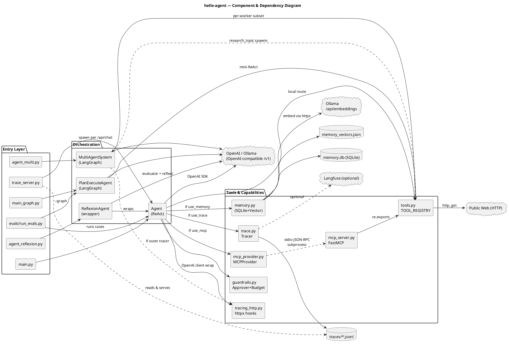
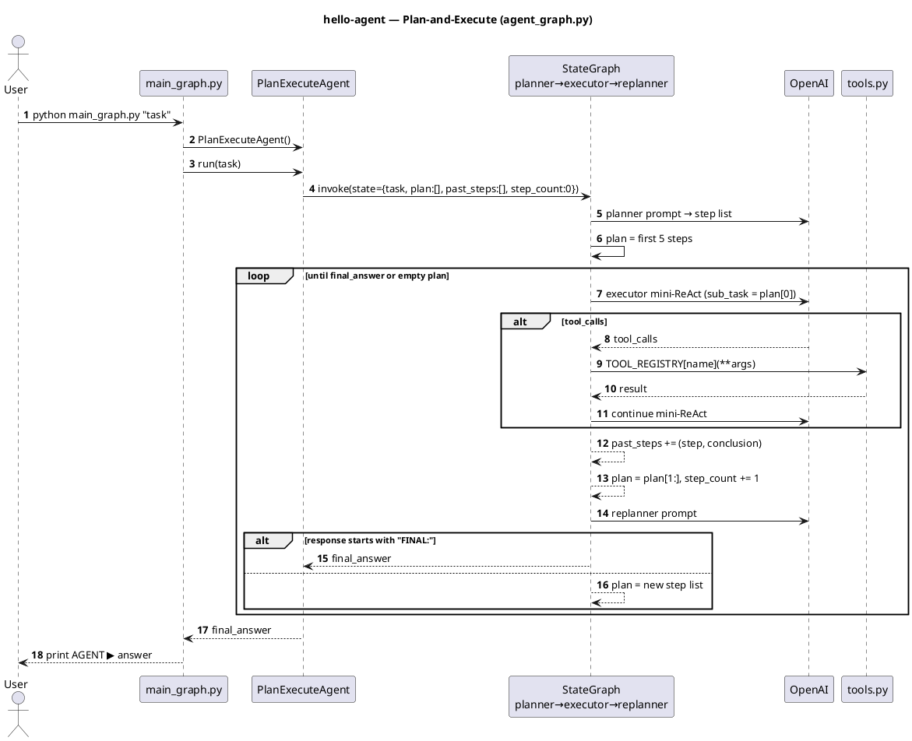
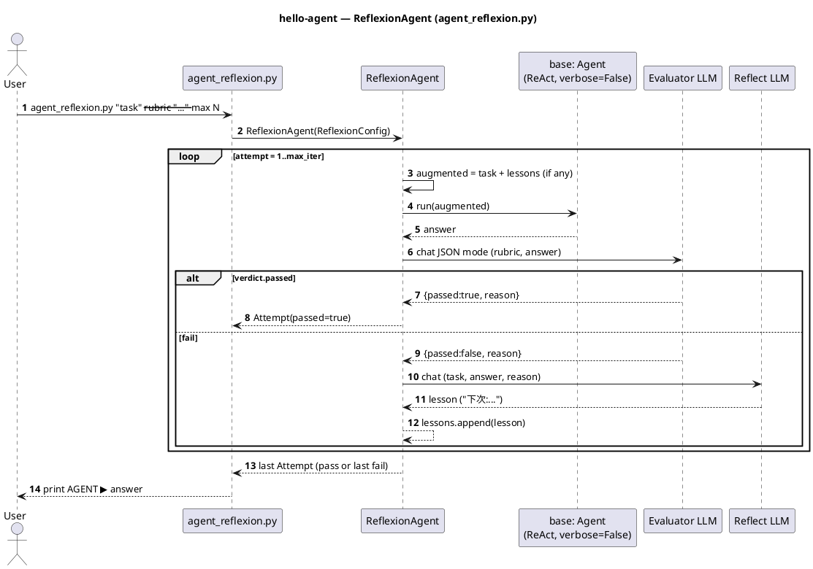
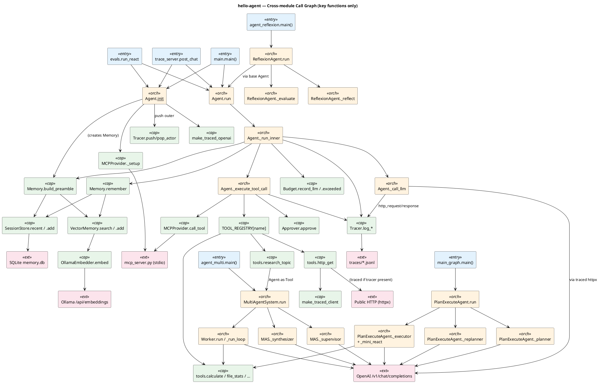
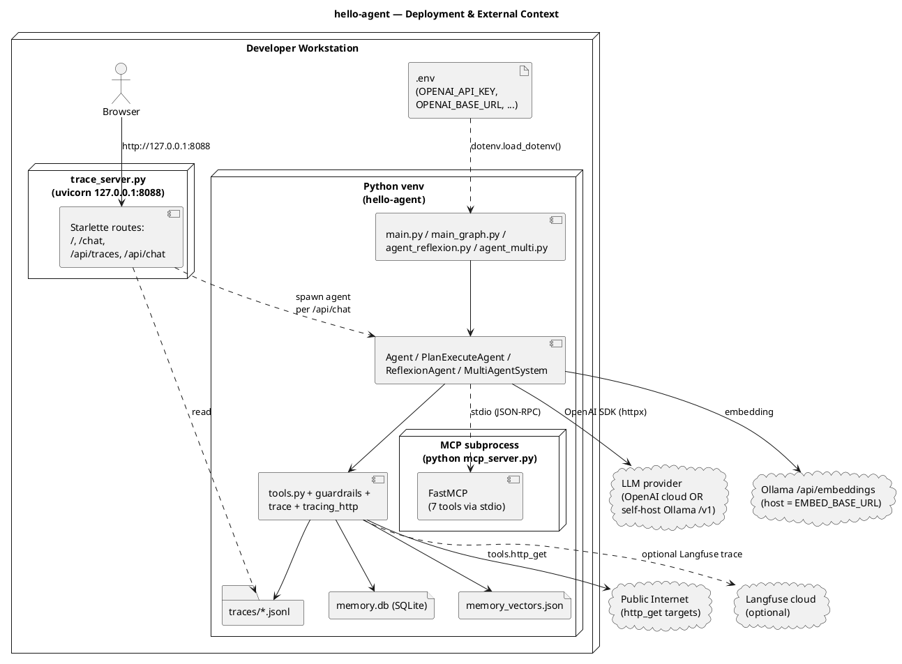
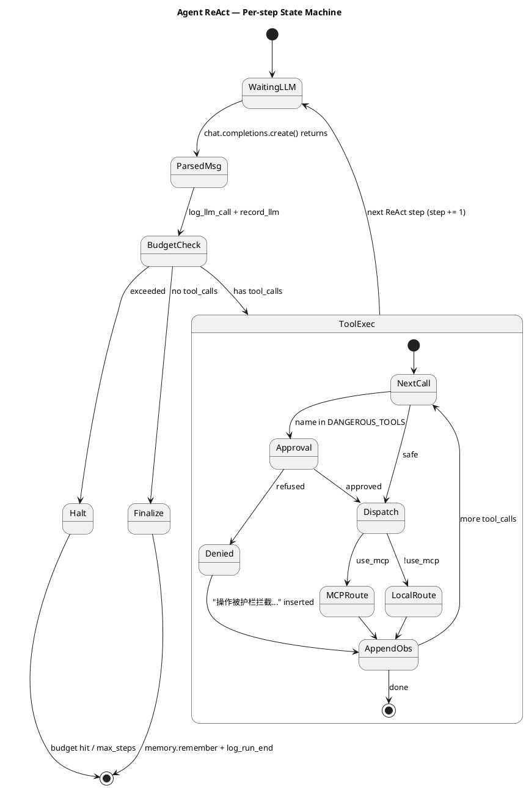

# System Architecture & LLD — `hello-agent`

> 范围(scope):本 LLD 仅覆盖 `examples/hello-agent/` 目录,即从 [`../../../docs/agent-development-guide.md`](../../../docs/agent-development-guide.md) 的 9 个 Step + 两个进阶模式(Reflexion / Multi-Agent)落地的端到端 Python 实现。仓库 `docs/` 目录下的其他 markdown 教程文件不在分析范围内。
>
> 证据基线:本文档全部引用真实的文件路径与符号(见各小节末尾的「证据」)。所有事实可在仓库内验证。

---

## 1. Overview

### 1.1 项目定位

`hello-agent` 是一个**教学级、自包含的 Agent 演示工程**,以 ReAct 为底座,并把 9 个能力点(ReAct → MCP → Memory → Plan-Execute → Guardrails → Trace → Evals)以及两个进阶模式(Reflexion、Multi-Agent / Agent-as-Tool)全部用最小可运行代码落地。整体倾向「pip 装好 + `.env` 填好就能跑」的零外部服务态势:

- **LLM**:OpenAI 兼容协议(可直连 OpenAI,也可指 Ollama 的 `/v1`)
- **MCP**:本仓库自带 `mcp_server.py`,由 client 端通过 stdio 子进程拉起
- **Memory**:SQLite(`memory.db`)+ JSON 向量库(`memory_vectors.json`),嵌入走 Ollama `/api/embeddings`
- **Trace**:本地 JSONL(`traces/*.jsonl`)+ 可选 Langfuse + 浏览器 viewer(Starlette + uvicorn)
- **Eval**:YAML 用例 + 硬规则 + LLM-as-Judge

### 1.2 顶层架构(Layered + Pluggable Capabilities)

整体是 **3 层** + 7 个**可插拔能力切面(cross-cutting concerns)**:

```
┌─────────────────────────────────────────────────────────────────┐
│ Entry Layer    main.py · main_graph.py · agent_reflexion.py    │
│                agent_multi.py · trace_server.py · evals/run_evals.py│
├─────────────────────────────────────────────────────────────────┤
│ Orchestration  Agent (ReAct)  ·  PlanExecuteAgent (LangGraph)   │
│ Layer          ReflexionAgent (wrapper) · MultiAgentSystem      │
│                (Supervisor + 4 Workers + Synthesizer)           │
├─────────────────────────────────────────────────────────────────┤
│ Capabilities   Tools(本地直连) · MCP(stdio 子进程)            │
│ & Tools        Memory(SQLite+VectorMem) · Guardrails           │
│                Trace(JSONL/Langfuse/HTTP hooks)                │
└─────────────────────────────────────────────────────────────────┘
                          │
                          ▼  外部依赖
                ┌─────────┴─────────┐
                ▼                   ▼
        OpenAI/Ollama LLM    Ollama Embeddings    Public HTTP    Langfuse (opt)
```

### 1.3 关键设计哲学

| 哲学 | 体现 |
|---|---|
| **能力切面(cross-cutting)** | MCP/Memory/Trace/Guardrails 全部通过 `AgentConfig` 的 `use_*` 标志位独立开关,可任意组合(`agent.py` L102–L121) |
| **工具是一等公民,可移植** | 同一组工具函数(`tools.py`)通过 3 条路径暴露:本地 `TOOL_REGISTRY`、`mcp_server.py`、`agent_multi.py` 的 Worker 子集 |
| **透明拦截优于侵入** | `tracing_http.py` 用 httpx event hooks 一次性抓住所有下游 HTTP(OpenAI/Ollama/`http_get`),业务代码 0 改动 |
| **Agent-as-Tool 嵌套** | `tools.research_topic` 内部 spawn 一个 `MultiAgentSystem`,通过模块级 `_current_tracer` 把外层 trace 透传进去 |
| **基于状态机表达复杂流程** | LangGraph 用于 Plan-Execute(`agent_graph.py`)与 Multi-Agent 路由(`agent_multi.py`) |

证据:`hello-agent/agent.py` L73–L131,`hello-agent/tools.py` L29–L35 / L172–L206,`hello-agent/tracing_http.py` L59–L95。

---

## 2. Modules and Responsibilities

下表把仓库 19 个 Python 文件(含 `evals/`)分门别类。所有模块都是 **纯 Python**,无 C 扩展。

### 2.1 入口模块(Entry Points)

| 文件 | 入口形式 | 启动什么 |
|---|---|---|
| `main.py` | CLI `python main.py [task]` | `Agent(AgentConfig())` ReAct 单次或交互 |
| `main_graph.py` | CLI `python main_graph.py [task]` | `PlanExecuteAgent()` LangGraph 状态机 |
| `agent_reflexion.py` | CLI `python agent_reflexion.py [task] --rubric ... --max N` | `ReflexionAgent(base=Agent(...))` 套娃 |
| `agent_multi.py` | CLI `python agent_multi.py [task]` | `MultiAgentSystem()` Supervisor + Worker |
| `mcp_server.py` | stdio JSON-RPC(被 MCP client 拉起) | `FastMCP("hello-agent-tools").run(stdio)` |
| `trace_server.py` | HTTP `uvicorn` `:8088` | Starlette app:`/`、`/chat`、`/api/*` |
| `evals/run_evals.py` | CLI `python evals/run_evals.py [--graph] [--filter X]` | 跑 `cases.yaml`,写 `report-<ts>.jsonl` |

### 2.2 核心 Orchestration 模块

| 文件 | 类 / 主要符号 | 职责 |
|---|---|---|
| `agent.py` | `Agent`, `AgentConfig`, `StepMetrics`, `SYSTEM_PROMPT` | **ReAct 循环主干**;按 `use_mcp/use_memory/use_trace/use_guardrails` 装配能力;`run()` 是公开 API |
| `agent_graph.py` | `PlanExecuteAgent`, `GraphState`, `GraphConfig` | **Plan-Execute**:Planner → Executor →(mini-ReAct)→ Replanner 循环 |
| `agent_reflexion.py` | `ReflexionAgent`, `ReflexionConfig`, `Attempt` | **Reflexion 包装器**:Executor → Evaluator → Reflect → 重试 |
| `agent_multi.py` | `MultiAgentSystem`, `Worker`, `WORKERS`, `MultiState`, `MultiConfig` | **Multi-Agent**:Supervisor + 4 Worker + Synthesizer(LangGraph) |

### 2.3 工具与能力模块

| 文件 | 主要符号 | 职责 |
|---|---|---|
| `tools.py` | `TOOL_REGISTRY`, `TOOL_SCHEMAS`, `DANGEROUS_TOOLS`, `set_tracer`, 10 个工具函数 | 工具实现 + OpenAI function schema 注册;`research_topic` 是 meta-tool |
| `mcp_server.py` | `mcp = FastMCP(...)`, 7 个 `@mcp.tool()` | 把工具暴露成 MCP 标准协议(仅普通工具,不含 dangerous / meta) |
| `mcp_provider.py` | `MCPProvider`, `MCPTool`, `build_default_provider` | 异步 MCP client 的同步包装(独立线程 + asyncio loop + AsyncExitStack) |
| `memory.py` | `OllamaEmbedder`, `SessionStore`, `VectorMemory`, `Memory` | SQLite 会话历史 + numpy 向量库 + Ollama embedding 三件套 |
| `guardrails.py` | `GuardrailsConfig`, `Budget`, `Approver` | 危险工具审批 + token/cost 上限 |
| `trace.py` | `Tracer` | JSONL 写入 + Actor stack(`outer`/`supervisor`/`worker-X`) + 可选 Langfuse |
| `tracing_http.py` | `make_traced_client`, `make_traced_openai`, `_decode_body` | httpx event hooks,透明 HTTP 抓包 |

### 2.4 服务 / 工具配套

| 文件 | 职责 |
|---|---|
| `trace_server.py` | 浏览器 Trace Viewer + Web Chat(Starlette,5 个 endpoint,~1859 行,绝大多数是内嵌 HTML/JS/CSS) |
| `evals/cases.yaml` | 10 条测试用例,涵盖 5 个 category(time/math/file/refusal/reason/format) |
| `evals/run_evals.py` | runner:执行用例 + 解析 trace 抓 `expected_tools` + LLM judge |

### 2.5 持久化文件(运行时)

| 文件 | 内容 | 写入方 |
|---|---|---|
| `memory.db` | SQLite,表 `turns(session_id, ts, user_input, agent_answer)` | `memory.SessionStore.add()` |
| `memory_vectors.json` | JSON 数组,每项 `{id, text, metadata, embedding[]}` | `memory.VectorMemory._save()` |
| `traces/<session>.jsonl` | 每行一个 event(`run_start` / `llm_call` / `tool_call` / `http_request` / `http_response` / `mcp_*` / `run_end`) | `trace.Tracer._write()` |
| `evals/report-<ts>.jsonl` | 每行一条用例结果 | `evals/run_evals.py` |

### 2.6 外部依赖(External)

| 类别 | 依赖 | 用途 | 是否必需 |
|---|---|---|---|
| LLM 客户端 | `openai>=1.54` | 所有 ChatCompletion | 必需 |
| HTTP | `httpx>=0.27` | 工具 `http_get` + Ollama embeddings | 必需 |
| MCP | `mcp>=1.0` | `FastMCP` server + `ClientSession` | 必需(也是 `starlette/uvicorn` 的间接来源) |
| 向量数学 | `numpy>=1.26` | `VectorMemory` cosine 相似度 | 必需 |
| YAML | `pyyaml>=6.0` | eval 用例 | Eval 时必需 |
| 状态机 | `langgraph>=1.0` | Plan-Execute / Multi-Agent | 这两个模式必需 |
| 时区 | `tzdata` (Win) | `get_current_time` IANA tz | Windows 必需 |
| 可观测 | `langfuse>=2.0` | 可选上报 | 可选 |
| 配置 | `python-dotenv>=1.0` | `.env` 加载 | 必需 |

证据:`hello-agent/requirements.txt`。

---

## 3. Interactions (Internal & External)

### 3.1 内部通信(进程内)

| 调用方 | 被调方 | 通信形式 | 触发场景 | 数据 |
|---|---|---|---|---|
| `main.py` | `Agent.run()` | Python 调用 | CLI 或交互 | `task: str` |
| `Agent._call_llm()` | `OpenAI().chat.completions.create()` | Python 库 | 每个 ReAct step | `messages, tools, model` |
| `Agent._execute_tool_call()` | `tools.TOOL_REGISTRY[name](**args)` 或 `MCPProvider.call_tool()` | 函数 / 同步包装 | LLM 返回 `tool_calls` | tool name + JSON args |
| `Agent.__init__` | `tools.set_tracer(tracer)` | 模块级状态注入 | Agent 启动 | `Tracer` 实例引用 |
| `tools.research_topic` | `MultiAgentSystem(tracer=_current_tracer).run()` | Python 调用 | LLM 调 `research_topic` | `topic, urls` |
| `MultiAgentSystem._supervisor` | `MultiAgentSystem._worker_node(name)` | LangGraph 边 | Supervisor 路由决策 | `MultiState` |
| `Worker._run_loop` | `TOOL_REGISTRY[name](**args)` | 函数 | Worker mini-ReAct | 工具子集(`allowed_tools`) |
| `Memory.build_preamble` | `SessionStore.recent` + `VectorMemory.search` | 函数 | `Agent._run_inner` 入口 | `user_input` |
| `Memory.remember` | `SessionStore.add` + `VectorMemory.add` | 函数 | `Agent._run_inner` 出口(LLM 给出 final_answer) | `(user, answer)` |
| `Agent._budget.record_llm` | `Budget` 计数 | 函数 | 每个 LLM 响应后 | usage |
| `Agent._approver.approve` | TTY input / env check | 函数 / 系统调用 | 工具名 ∈ `DANGEROUS_TOOLS` | tool name + args |

### 3.2 外部通信(跨进程 / 网络)

| 主动方 | 对端 | 协议 | 端口 / Schema | 数据 |
|---|---|---|---|---|
| `Agent._call_llm()` via `OpenAI` SDK | OpenAI / Ollama `/v1` | HTTPS / HTTP | `OPENAI_BASE_URL` | `POST /v1/chat/completions` |
| `OllamaEmbedder.embed` | Ollama `/api/embeddings` | HTTP | `EMBED_BASE_URL` | `POST {model, prompt}` |
| `tools.http_get` | 公网 URL | HTTP / HTTPS | `http(s)://...` | `GET` ,timeout 10s |
| `MCPProvider._setup` | `mcp_server.py` 子进程 | stdio + JSON-RPC | pipe | MCP `initialize` / `list_tools` / `call_tool` |
| `trace_server.py` | 浏览器 | HTTP | `127.0.0.1:8088` | `/`、`/chat`、`/api/traces`、`/api/chat` |
| `Tracer.log_*` (opt) | Langfuse 云 | HTTPS | `LANGFUSE_HOST` | `trace.generation/span/update` |

### 3.3 HTTP 透明拦截(关键设计点)

`tracing_http.py` 通过给 httpx 注入 `event_hooks={"request": [...], "response": [...]}`,把以下三条 HTTP 链路**全部自动**变成 `http_request`/`http_response` 事件:

1. `OpenAI` SDK(底层 httpx)— 所有 LLM 调用
2. `OllamaEmbedder`(`make_traced_client`)— 所有嵌入调用
3. `tools.http_get`(发现 `_current_tracer` 时切换到 `make_traced_client`)— 公网抓取

业务代码 0 改动,这是 Trace 模式可以**事后 curl 重放任意一次 LLM 请求**的根本原因。

证据:`hello-agent/tracing_http.py` L59–L95,`hello-agent/tools.py` L138–L155,`hello-agent/memory.py` L44–L49。

---

## 4. Execution Flows

> 本节是 LLD 的**核心交付物**。所有流程都从真实代码反推。

### 4.1 启动流程:`Agent.__init__`

按构造顺序(`agent.py` L76–L131),依赖关系决定了顺序:

```
1. 解析 AgentConfig            ← .env / 环境变量
2. 生成 session_id              ← config.session_id or uuid[:8]
3. (可选)Tracer = Tracer(session_id)    ← 必须先于 client 创建,否则下游 HTTP 不入 trace
4. tools.set_tracer(tracer)             ← 模块级注入,供 research_topic 透传
5. self.client = make_traced_openai(tracer) | OpenAI()
6. (可选)self._mcp = build_default_provider(tracer)
       └─→ 启动后台线程 → asyncio loop → stdio_client(python mcp_server.py)
              → ClientSession.initialize() → list_tools()
              → tracer.log("mcp_initialize", {tools: [...]})
   self.tool_schemas = mcp.list_tools_openai_format() or TOOL_SCHEMAS
7. (可选)self._memory = Memory(session_id, tracer)
       └─→ SessionStore(SQLite open) + VectorMemory(load json) + OllamaEmbedder(traced httpx)
8. GuardrailsConfig.from_env() → Budget + Approver
9. self._reset_messages()  ← [{"role":"system", "content": SYSTEM_PROMPT}]
```

**关键顺序约束**:Tracer 必须最先初始化,因为之后的 OpenAI client / MCP / Memory 都要把 tracer 传进去才能拿到完整 trace。

### 4.2 ReAct 主循环:`Agent.run`

```
run(task)
├─ self._reset_messages()
├─ tracer.push_actor("outer")
└─ _run_inner(task, t0):
    ├─ if memory: preamble = memory.build_preamble(task)
    │    └─ session.recent(3) + vector.search(task, k=3)
    │       ↳ 命中则 messages.append({"role":"system", "content": preamble})
    ├─ tracer.log_run_start(task)
    ├─ messages.append({"role":"user", "content": task})
    │
    └─ for step in 1..max_steps:           ─────────── ReAct 循环 ───────────
        ├─ response = client.chat.completions.create(...)
        │    ↳ httpx hook 自动写 http_request / http_response
        ├─ msg = response.choices[0].message
        ├─ messages.append(msg.model_dump())
        ├─ budget.record_llm(prompt/completion/total)
        ├─ tracer.log_llm_call(step, model, tokens, latency, thought)
        │
        ├─ if budget.exceeded(): break with "已触发预算护栏"
        │
        ├─ if not msg.tool_calls:           ─── 终止条件:LLM 不再发 tool_call
        │    ├─ final_answer = msg.content
        │    ├─ tracer.log_run_end(final, total_tokens, elapsed)
        │    ├─ if memory: memory.remember(task, final)
        │    └─ return final_answer
        │
        └─ for call in msg.tool_calls:      ─── 执行工具
            ├─ name = call.function.name
            ├─ args = json.loads(call.function.arguments)
            ├─ if name in DANGEROUS_TOOLS:
            │    └─ ok, reason = approver.approve(name, args)
            │       ↳ deny → tool_result = "操作被护栏拦截..." 注入对话,跳过执行
            ├─ if use_mcp: result = mcp.call_tool(name, args)
            │              else:  result = TOOL_REGISTRY[name](**args)
            ├─ messages.append({"role":"tool", "tool_call_id": call.id, "content": result})
            └─ tracer.log_tool_call(step, name, args, result, latency)
```

**终止条件 4 种**:
1. LLM 不再返回 `tool_calls`(成功路径,给出 final answer)
2. `Budget.exceeded()`(token 或 cost 触顶)
3. `step >= max_steps`(防死循环)
4. 中间任何异常 → 把异常字符串作为 `tool_result` 喂给 LLM,让它换思路(不直接 abort)

### 4.3 嵌套流程:Agent-as-Tool(`research_topic`)

这是本仓库**最有教学价值的一段**。outer ReAct 调用一次 `research_topic`,产生 25+ trace events 的嵌套调用层次:

```
outer Agent (actor="outer")
└─ Step N: LLM 返回 tool_call(research_topic, {topic, urls:[...]})
   └─ tools.research_topic(topic, urls):
      ├─ 读模块级 _current_tracer(由 Agent.__init__ 注入)
      ├─ MultiAgentSystem(tracer=_current_tracer)
      │    └─ make_traced_openai(tracer)   ← 内部 client 也带 hooks
      └─ system.run(task):
          ├─ Supervisor (actor="supervisor")   ← tracer.push_actor
          │    └─ client.chat.completions.create()  ─→ trace: http_request/response
          │    └─ 返回 {"next_worker": "WebWorker", "subtask": "..."}
          ├─ WebWorker (actor="worker-WebWorker")
          │    └─ _run_loop:
          │         ├─ client.chat → 决定调 http_get
          │         └─ http_get(url):
          │              └─ make_traced_client(tracer)
          │                 ↳ 公网请求也进 trace
          ├─ Supervisor (round 2) → DONE
          └─ Synthesizer (actor="synthesizer")
               └─ client.chat → 最终 answer
   ↓ 返回字符串给 outer
   tools.research_topic returns answer
└─ Step N+1:outer 把 answer 整理给用户
```

Trace viewer 上能看到完整的 actor 层级与 LLM 调用嵌套。

证据:`hello-agent/tools.py` L172–L206,`hello-agent/agent_multi.py` L240–L274,`hello-agent/trace.py` L46–L54。

### 4.4 Plan-and-Execute(LangGraph)

```
PlanExecuteAgent.run(task):
└─ StateGraph 执行:
    [planner] → 输出 plan: list[str]
       │
       ▼
    [executor] → 取 plan[0] 当前 step
       │     └─ _mini_react(sub_task, max_iters=4):
       │         └─ 内部循环:LLM → tool_calls → 工具执行 → ...
       │            ↳ 直到没有 tool_call,返回字符串结论
       │     └─ past_steps.append((step, result))
       │     └─ plan = plan[1:], step_count += 1
       ▼
    [replanner] → LLM 决定:
       ├─ FINAL: <答案>            → final_answer set
       └─ <更新的步骤列表>         → plan = new_plan
       │
       └─ _should_continue:
           ├─ final_answer set?       → END
           ├─ no plan left?           → replanner(再判一次)
           ├─ step_count >= max?      → END
           └─ otherwise                → executor
```

注意:`agent_graph.py` 不接 Memory/MCP/Trace,刻意保持「最小可读 LangGraph 示例」(`agent_graph.py` L22 注释)。

### 4.5 Multi-Agent(Supervisor + Worker + Synthesizer)

```
MultiAgentSystem.run(task):
└─ StateGraph 执行:
    [supervisor] → JSON output {next_worker, subtask}
       │
       ├─ next_worker ∈ {TimeWorker, MathWorker, FileWorker, WebWorker}
       │     ▼
       │  [worker]  ← Worker.run 用受限的 allowed_tools 子集 mini-ReAct
       │     │     └─ worker_outputs.append({worker, subtask, output})
       │     ▼
       │  [supervisor] (round+=1) 再次决策
       │
       └─ next_worker == "DONE" 或 rounds > max_rounds
             ▼
          [synthesizer] → 合成最终答案 → END
```

**Worker 工具子集**(`agent_multi.py` L136–L182):
- TimeWorker → `{get_current_time}`
- MathWorker → `{calculate}`
- FileWorker → `{list_files, read_file, file_stats, word_count}`
- WebWorker → `{http_get}`

### 4.6 Reflexion(套娃)

```
ReflexionAgent.run(task, rubric, max_iter):
└─ for attempt in 1..max_iter:
    ├─ augmented_task = task + "\n来自上次失败的反思:\n" + "\n".join(lessons)
    ├─ answer = base.run(augmented_task)            ← 这里 base = Agent (ReAct)
    ├─ verdict = self._evaluate(task, answer)       ← 1 次 LLM (JSON mode)
    │     ↳ {passed: bool, reason: str}
    ├─ if verdict.passed: return Attempt(answer, passed=True, ...)
    └─ lesson = self._reflect(task, answer, reason) ← 1 次 LLM
       lessons.append(lesson)
```

每次 attempt 都是一次完整的 base ReAct,**前一次的教训**作为 user input 的一部分注入。

### 4.7 MCP 路径(stdio 子进程)

```
Agent.__init__ (use_mcp=True):
└─ MCPProvider.__init__:
    ├─ 起 daemon thread 跑独立 asyncio.event_loop
    ├─ _connect() → run_coroutine_threadsafe(_setup):
    │    ├─ AsyncExitStack()
    │    ├─ stdio_client(StdioServerParameters(command=python, args=[mcp_server.py]))
    │    │   ↳ 拉起子进程,拿到 read/write streams
    │    ├─ ClientSession(read, write)
    │    ├─ session.initialize()       ← MCP handshake
    │    └─ session.list_tools()       ← 拿到 MCPTool 列表
    └─ tracer.log("mcp_initialize", {command, args, tools})

每次工具调用:
└─ MCPProvider.call_tool(name, args):
    ├─ tracer.log("mcp_request", ...)
    ├─ _submit(_call_tool):
    │    ├─ session.call_tool(name, args)        ← JSON-RPC over stdio
    │    └─ 拼接 result.content[*].text → str
    └─ tracer.log("mcp_response", {latency_s, result_preview})
```

### 4.8 Web Chat 流程(`trace_server.py`)

```
浏览器 POST /api/chat {prompt, session, turn, use_mcp, use_memory}
└─ post_chat (async):
    ├─ trace_session = f"{session}-{turn:03d}"
    └─ loop.run_in_executor(_AGENT_EXECUTOR, _run_agent_blocking, ...):
         ├─ 持 _AGENT_LOCK(全局串行化,因为 tools._current_tracer 是模块级状态)
         ├─ Agent(AgentConfig(use_trace=True, ...))  ← 每次新建,关闭后丢弃
         ├─ answer = agent.run(prompt)
         ├─ agent.close()
         └─ _extract_steps(traces/<trace_session>.jsonl)  ← 解析 outer 步骤
    └─ JSONResponse({answer, trace_session, steps, total_tokens, elapsed_s})
```

### 4.9 错误处理路径

| 来源 | 捕获位置 | 行为 |
|---|---|---|
| LLM 返回非法 JSON args | `agent.py` L268–L274 `json.JSONDecodeError` | tool_result = 错误字符串,trace `is_error=true`,继续循环 |
| 工具内部异常 | `agent.py` L297–L303 `except Exception` | 同上,**不 abort** |
| 危险工具被拒 | `Approver.approve` 返回 `(False, reason)` | tool_result = "操作被护栏拦截...",喂回 LLM 让它换路径 |
| MCP 子进程崩溃 | `MCPProvider._submit` 抛出 → `_execute_tool_call` 捕获 | 同工具异常 |
| Ollama embedding 失败 | `Memory.remember` `except Exception: pass` | 仅 vector 写入失败,session 仍落库 |
| Langfuse 调用失败 | `Tracer.log_llm_call` 内每个 `try/except` | 静默吞掉,不影响主流程 |
| 预算超额 | `Budget.exceeded()` 在每个 LLM 响应后检查 | 立即终止循环,`final_answer="已触发预算护栏..."` |
| 子进程参数路径错误 | `mcp_provider.build_default_provider` | 用 `sys.executable + mcp_server.py`,假设 cwd 是 `hello-agent/` |

---

## 5. Function-Level Analysis

> 受篇幅限制,本节聚焦**关键函数**(被多处调用 / 跨模块边界 / 含副作用)。每个条目列出位置、用途、入参、出参、副作用、调用方与被调方。

### 5.1 `Agent` 类(`agent.py`)

#### `Agent.__init__(config)` — L76–L131
- **用途**:按配置装配 ReAct agent 的所有依赖。
- **入参**:`config: AgentConfig | None`
- **副作用**:
  - 创建 / 打开:`traces/<session>.jsonl`(lazy)、`memory.db`、`memory_vectors.json`
  - 拉起 MCP 子进程(若 `use_mcp`)
  - 写入模块级 `tools._current_tracer`
- **调用方**:`main.py`、`evals/run_evals.py`、`trace_server._run_agent_blocking`、`agent_reflexion.ReflexionAgent.__init__`
- **被调方**:`Tracer`、`make_traced_openai`、`build_default_provider`、`Memory`、`GuardrailsConfig.from_env`

#### `Agent.run(user_input)` — L140–L149
- **用途**:对外的单次任务入口。
- **入参**:`user_input: str`
- **返回**:`final_answer: str`
- **副作用**:`tracer.push_actor("outer")` → 调 `_run_inner` → `pop_actor`
- **调用方**:所有 entry 模块

#### `Agent._run_inner(user_input, run_started)` — L151–L243
- **用途**:ReAct 主循环本体(见 4.2)。
- **关键分支**:`memory.build_preamble`、`_call_llm`、`_execute_tool_call`、`_budget.exceeded`
- **被调方**:见 4.2 流程图

#### `Agent._call_llm()` — L257–L263
- **用途**:一次 ChatCompletion(`tool_choice="auto"`)。
- **返回**:OpenAI response 对象,含 `.choices[0].message.tool_calls`

#### `Agent._execute_tool_call(step, call)` — L265–L308
- **用途**:执行 LLM 返回的一次 tool_call,统一加上 guardrail 审批与异常包装。
- **副作用**:
  - 调用 `Approver.approve`(若 `name in DANGEROUS_TOOLS`)
  - 调用 `MCPProvider.call_tool` 或 `TOOL_REGISTRY[name](**args)`
  - 把结果以 `role=tool` 追加到 `self.messages`
  - 写 trace `tool_call` 事件

#### `Agent.close()` — L245–L251
- **副作用**:关闭 MCP / Memory / Tracer

### 5.2 Tools(`tools.py`)

| 函数 | 类型 | 入参 | 副作用 |
|---|---|---|---|
| `set_tracer(tracer)` | injector | tracer | 写模块全局 `_current_tracer` |
| `get_current_time(timezone="UTC")` | pure | str | 仅读系统时钟 |
| `calculate(expression)` | pure | str | `eval` 在受限命名空间 |
| `list_files(path=".", pattern="*")` | I/O | 2 strs | 文件系统读 |
| `read_file(path, max_chars=4000)` | I/O | str + int | 读 UTF-8 文件,自动截断 |
| `word_count(text)` | pure | str | — |
| `file_stats(path)` | I/O | str | 流式扫描,**不入上下文** |
| `write_file(path, content)` | ⚠️ destructive | str+str | 覆盖写 |
| `delete_file(path)` | ⚠️ destructive | str | `Path.unlink()` |
| `http_get(url, max_chars=4000)` | I/O / 网络 | str+int | 公网 GET;若 `_current_tracer` 非空走 traced client |
| `research_topic(topic, urls)` | 🧠 meta | str + list[str] | 进程内 spawn `MultiAgentSystem` |

**注册表**:`TOOL_REGISTRY: dict[str, Callable]`(10 条)、`TOOL_SCHEMAS: list[dict]`(OpenAI function 格式)、`DANGEROUS_TOOLS: set[str] = {"write_file", "delete_file"}`。

证据:`hello-agent/tools.py` L247–L261。

### 5.3 MCP 层

#### `MCPProvider.__init__(command, args, tracer)` — `mcp_provider.py` L33–L54
- **副作用**:启动 daemon thread 跑 asyncio loop;同步调 `_setup` 把子进程拉起来;写 `mcp_initialize` event。

#### `MCPProvider.call_tool(name, arguments)` — L77–L97
- **入参**:`name: str, arguments: dict`
- **返回**:`str`(拼接后的文本)
- **副作用**:写 `mcp_request` / `mcp_response`

#### `MCPProvider._call_tool` (async) — L138–L151
- 走 `ClientSession.call_tool`;拼接 `result.content` 文本块;若 `result.isError` 加 "错误:" 前缀。

### 5.4 Memory 层

#### `Memory.build_preamble(user_input)` — `memory.py` L204–L225
- **副作用**:调 `vector.search(user_input, k=3)`(会触发一次 Ollama embedding HTTP)
- **返回**:拼接好的 markdown 文本 或 `None`

#### `Memory.remember(user_input, agent_answer)` — L227–L236
- **副作用**:
  - `SessionStore.add` → SQLite INSERT
  - `VectorMemory.add` → embedding + JSON rewrite
  - 嵌入失败时 `try/except pass`,session 仍落库

#### `VectorMemory.search(query, k=3, min_score=0.3)` — L163–L180
- 算法:cosine,纯 numpy;在 `min_score` 之上排序取 top-k。

### 5.5 Trace 层

#### `Tracer._write(event, data)` — `trace.py` L214–L227
- 自动注入 `actor` 字段(若调用方未塞)
- 写 `traces/<session>.jsonl`,flush 后保证 viewer 实时可见

#### `Tracer.push_actor / pop_actor` — L46–L54
- 用于 multi-agent:`outer` / `supervisor` / `worker-<X>` / `synthesizer`
- Viewer 用 actor 区分嵌套层次

#### `Tracer.rotate(new_session_id)` — L184–L208
- 交互模式下每轮 chat 切换文件;若旧文件为空则 unlink。

### 5.6 HTTP 拦截

#### `make_traced_client(tracer, **kwargs)` — `tracing_http.py` L59–L95
- 返回 `httpx.Client(event_hooks=...)`
- `request_hook`:写 `_trace_started=perf_counter()` 到 `request.extensions`,记录 `http_request`
- `response_hook`:`response.read()` → 计算 latency → 记录 `http_response`(含 body JSON 解析)

#### `make_traced_openai(tracer)` — L98–L103
- 返回 `OpenAI(http_client=make_traced_client(tracer, timeout=OPENAI_TIMEOUT_S))`

### 5.7 LangGraph 子系统

#### `PlanExecuteAgent._build_graph()` — `agent_graph.py` L239–L253
- 节点:`planner`、`executor`、`replanner`
- 边:`planner→executor→replanner`;`replanner` 条件边:`{executor, replanner, end}`

#### `MultiAgentSystem._build_graph()` — `agent_multi.py` L391–L407
- 节点:`supervisor`、4 个 Worker、`synthesizer`
- 边:`supervisor` 条件边 → Worker 或 `synthesizer`;Worker → `supervisor`;`synthesizer → END`

---

## 6. Design Observations

### 6.1 总体架构判定

- **形态**:单体 Python 应用 + 同进程多 agent。MCP server 是被拉起的子进程,但本质仍属同一逻辑应用;不是「微服务」。
- **风格**:**分层(Entry → Orchestration → Capabilities)** + **能力切面(MCP/Memory/Trace/Guardrails 各自独立可插)** + **状态机(LangGraph 用于 Plan-Execute 与 Multi-Agent 路由)**。
- **配置驱动**:所有能力开关由 `AgentConfig` + `.env` 决定;`Agent.__init__` 是装配中心。

### 6.2 设计模式清单(对应代码)

| 模式 | 体现 |
|---|---|
| Strategy / Pluggable Backend | `use_mcp` 在 `agent.py` L101–L108 切换工具后端 |
| Adapter | `MCPProvider`(异步 MCP → 同步 API);`make_traced_openai`(把 OpenAI 套上自定义 httpx) |
| Facade | `Memory`(对外只暴露 `build_preamble / remember / close`) |
| Observer / Hook | `tracing_http.py` httpx event hooks(request/response) |
| Decorator / Wrapper | `ReflexionAgent`(包 `Agent`);`make_traced_client` 包 `httpx.Client` |
| State Machine | `agent_graph.py` 与 `agent_multi.py` 的 LangGraph |
| Command(隐式) | OpenAI `tool_calls` → `_execute_tool_call` 派发 |
| Registry | `TOOL_REGISTRY` / `TOOL_SCHEMAS` / `WORKERS` |
| Meta-tool / Agent-as-Tool | `tools.research_topic` 内部 spawn `MultiAgentSystem` |
| Tracer / Cross-cutting concern | `Tracer.push_actor` stack;`tools._current_tracer` 模块级注入 |

### 6.3 紧耦合点(技术债 / 风险)

| 位置 | 类型 | 说明 | 缓解 |
|---|---|---|---|
| `tools._current_tracer` 模块级状态 | 全局可变状态 | 同时跑两个 `Agent` 会互相覆盖。`trace_server.py` 已用 `_AGENT_LOCK` 串行化(L40–L41)。 | 已意识;生产场景应改为 ContextVar |
| `mcp_provider.build_default_provider` 默认 `args=["mcp_server.py"]` | cwd 假设 | 必须从 `hello-agent/` 目录启动 | 可改成 `__file__` 绝对路径 |
| `agent.py` 与 `agent_multi.py` 各自维护一份 ANSI 色码 `class C` | 重复代码 | 两份独立常量 | 可抽到 `_colors.py` |
| `Worker._run_loop` 与 `Agent._execute_tool_call` 工具执行逻辑相似但独立 | 重复 | Worker 不走 Guardrails / MCP | 设计是有意的(隔离),但可抽通用调度器 |
| `trace_server.py` 嵌入 ~1500 行 HTML/JS | 单文件膨胀 | 不利于前后端分离 | 教学场景可接受 |
| `agent_graph.py` 不接 Memory/MCP/Trace | 能力缺失 | 注释 L22 写明刻意如此 | — |
| `mcp_server.py` 不暴露 `write_file/delete_file/research_topic` | 安全 + meta 限制 | 故意只暴露 7 个普通工具 | 正确 |

### 6.4 关键路径(Critical Paths)

1. **每个 ReAct step 的延迟瓶颈**:`client.chat.completions.create()` (`agent.py` L257–L263)——99% 时间在这里。
2. **工具调用延迟瓶颈**:`tools.http_get`(外部公网)、`OllamaEmbedder.embed`(Memory 注入 / 回写)。
3. **MCP 路径增加的额外延迟**:每次工具调用多一次 stdio JSON-RPC round-trip(`mcp_provider.call_tool`)。
4. **Trace 写入**:每个事件 `fp.flush()`(`trace.py` L227),保证 viewer 实时刷新,代价是高频 I/O。

### 6.5 安全 / 护栏面

| 风险 | 防线 |
|---|---|
| Prompt injection 让 LLM 调 `delete_file` / `write_file` | `DANGEROUS_TOOLS` + `Approver` 在工具执行前拦截;非 TTY 默认拒绝 |
| LLM 无限循环烧 token | `AGENT_MAX_STEPS`(默认 10) + `MAX_TOTAL_TOKENS` + `MAX_COST_USD` |
| `eval(expression)` 注入 | `calculate` 把 `__builtins__` 设为 `{}`,只放白名单符号 |
| `http_get` SSRF | scheme 必须 `http(s)://`;但**未限制目标 IP**(可达内网/localhost) — `agent_multi.WebWorker` system prompt 提示不要,这是软约束,不是强保护 |
| 命令注入 | 无 shell 调用;`MCPProvider` 用 `sys.executable + mcp_server.py`,参数固定 |
| Langfuse key 误抓 | `_init_langfuse` 失败静默(`trace.py` L242),不会阻断主流程 |

### 6.6 可观测性成熟度

| 维度 | 状态 |
|---|---|
| 日志(stdout) | 彩色 ReAct trace + Plan-Execute / Multi-Agent / Reflexion 专属格式 |
| 结构化事件 | `traces/*.jsonl`(8 种 event 类型,actor 标记 + step 关联) |
| HTTP 抓包 | 透明覆盖 LLM + embedding + http_get(`tracing_http.py`) |
| MCP RPC 抓包 | `mcp_request` / `mcp_response`(`mcp_provider.py` L77–L96) |
| UI Viewer | `trace_server.py` 5 个 endpoint + mermaid call flow + 时间线 |
| 外部聚合 | 可选 Langfuse(`LANGFUSE_*` 环境变量) |
| 指标 | `Budget` 累计 token / cost;`StepMetrics` 单步延迟 |

### 6.7 测试与回归

`evals/run_evals.py` + `cases.yaml` 提供 10 条用例,**5 种检查**(`expected_substrings` / `forbidden_substrings` / `expected_tools` / `forbidden_tools` / `judge`)任意组合,可生成 `report-<ts>.jsonl`。`expected_tools` 从 trace 文件解析,要求 `use_trace=1`(`run_evals.py` L130–L132 强制设置)。

### 6.8 可演进方向(已在 README 列出)

- 替换 `VectorMemory` numpy 实现 → Chroma / pgvector / Qdrant
- `Agent.run` 包 FastAPI + streaming
- `ContextVar` 替代 `tools._current_tracer` 模块全局
- Reflexion + Multi-Agent 组合(supervisor 也套上 reflexion)

---

## 7. Diagrams

### 7.1 Component Diagram(组件 / 依赖)



### 7.2 Sequence Diagram — ReAct + MCP + Memory + Trace(典型一次任务)

```plantuml
@startuml sequence-react
title hello-agent — ReAct 主流程(MCP + MEMORY + TRACE 全开)
autonumber
actor User
participant "main.py" as M
participant "Agent" as A
participant "Tracer" as TR
participant "Memory" as MEM
participant "OllamaEmbedder\n(traced httpx)" as EMB
database "memory.db /\nmemory_vectors.json" as DB
participant "OpenAI client\n(traced httpx)" as LLMC
cloud "LLM /v1/chat/completions" as LLM
participant "MCPProvider" as MP
participant "mcp_server.py\n(subprocess)" as MS
participant "tools.py" as T
database "traces/<sid>.jsonl" as TJ

User -> M: python main.py "task"
M -> A: Agent(AgentConfig())
A -> TR: Tracer(session_id)
A -> T: set_tracer(tracer)
A -> LLMC: make_traced_openai(tracer)
A -> MP: build_default_provider(tracer)
MP -> MS: spawn subprocess (stdio)
MS --> MP: initialize + tools/list
MP -> TR: log mcp_initialize
A -> MEM: Memory(session_id, tracer)
MEM -> DB: open SQLite + load JSON

User -> A: run("task")
A -> MEM: build_preamble(task)
MEM -> EMB: embed(task)
EMB -> TR: log http_request/response
MEM -> DB: SELECT recent + cosine search
MEM --> A: preamble (or None)
A -> TR: log_run_start

loop ReAct step until no tool_calls / budget / max_steps
  A -> LLMC: chat.completions.create(messages, tools)
  LLMC -> TR: log http_request
  LLMC -> LLM: POST /v1/chat/completions
  LLM --> LLMC: response
  LLMC -> TR: log http_response
  LLMC --> A: msg with optional tool_calls
  A -> TR: log_llm_call(step, tokens, latency)
  A -> A: Budget.record + exceeded? else continue
  alt msg.tool_calls present
    loop each tool_call
      A -> A: Approver.approve (if dangerous)
      A -> MP: call_tool(name, args)
      MP -> TR: log mcp_request
      MP -> MS: JSON-RPC call_tool
      MS -> T: TOOL_REGISTRY[name](**args)
      T --> MS: str result
      MS --> MP: content blocks
      MP -> TR: log mcp_response
      MP --> A: result string
      A -> TR: log_tool_call
    end
  else no tool_calls
    A -> MEM: remember(task, final_answer)
    MEM -> DB: INSERT + vector.add
    A -> TR: log_run_end
    A --> User: final_answer
  end
end
@enduml
```

### 7.3 Sequence Diagram — Agent-as-Tool 嵌套(`research_topic`)

```plantuml
@startuml sequence-research
title hello-agent — research_topic(Agent-as-Tool 嵌套)
autonumber
participant "outer Agent\n(actor=outer)" as OUTER
participant "tools.research_topic" as RT
participant "MultiAgentSystem" as MAS
participant "Supervisor\n(actor=supervisor)" as SUP
participant "WebWorker\n(actor=worker-WebWorker)" as WW
participant "Synthesizer\n(actor=synthesizer)" as SYN
participant "Tracer" as TR
cloud "LLM /v1/chat/completions" as LLM
cloud "Public Web" as WEB

OUTER -> LLM: chat (step N, gets tool_call research_topic)
OUTER -> RT: research_topic(topic, urls)
RT -> RT: read _current_tracer (module-level)
RT -> MAS: MultiAgentSystem(tracer=outer_tracer)
RT -> MAS: run(task)

MAS -> TR: push_actor("supervisor")
MAS -> SUP: supervisor node
SUP -> LLM: chat (JSON mode) — pick next_worker
SUP --> MAS: {next_worker: "WebWorker", subtask}
MAS -> TR: pop_actor

MAS -> TR: push_actor("worker-WebWorker")
MAS -> WW: worker.run(subtask)
WW -> LLM: mini-ReAct: chat → tool_call http_get
WW -> WEB: http_get(url) (traced httpx)
WEB --> WW: response
WW --> MAS: worker output
MAS -> TR: pop_actor

MAS -> SUP: supervisor round 2 → DONE
MAS -> TR: push_actor("synthesizer")
MAS -> SYN: synthesizer node
SYN -> LLM: chat → final answer
MAS -> TR: pop_actor
MAS --> RT: answer string
RT --> OUTER: return tool result

OUTER -> LLM: chat (step N+1) → final answer to user
@enduml
```

### 7.4 Sequence Diagram — Plan-and-Execute(LangGraph)



### 7.5 Sequence Diagram — Multi-Agent(Supervisor + Worker + Synthesizer)

```plantuml
@startuml sequence-multi
title hello-agent — MultiAgentSystem (agent_multi.py)
autonumber
actor User
participant "agent_multi.py CLI" as CLI
participant "MultiAgentSystem" as MAS
participant "Supervisor" as SUP
participant "Worker\n(Time|Math|File|Web)" as W
participant "Synthesizer" as SYN
cloud "LLM" as LLM
participant "tools.py" as T

User -> CLI: python agent_multi.py "task"
CLI -> MAS: MultiAgentSystem()
CLI -> MAS: run(task)

loop round = 1..max_rounds (default 6) until DONE
  MAS -> SUP: supervisor node
  SUP -> LLM: chat (JSON mode) {next_worker, subtask}
  alt next_worker in WORKERS
    SUP --> MAS: route to worker
    MAS -> W: worker.run(subtask) using allowed_tools subset
    loop mini-ReAct max_iters=4
      W -> LLM: chat (tools = subset schemas)
      alt tool_call & allowed
        W -> T: TOOL_REGISTRY[name](**args)
        T --> W: result
      else not allowed
        W --> W: tool_result = "错误:不允许调用..."
      end
    end
    W --> MAS: output string
    MAS --> MAS: worker_outputs.append(...)
  else next_worker == "DONE" or round > max
    SUP --> MAS: route synthesizer
  end
end

MAS -> SYN: synthesizer node
SYN -> LLM: chat → final answer
SYN --> MAS: final_answer

MAS --> CLI: final_answer
CLI --> User: print AGENT ▶ answer
@enduml
```

### 7.6 Sequence Diagram — Reflexion 包装器



### 7.7 Call Graph — 跨模块关键函数



### 7.8 Deployment / Context Diagram



### 7.9 State Diagram — Agent ReAct Step Lifecycle



---

## Appendix A — File Inventory(Quick Reference)

| 文件 | 行数(约) | 角色 |
|---|---|---|
| `main.py` | 73 | ReAct CLI |
| `main_graph.py` | 49 | Plan-Execute CLI |
| `agent.py` | 436 | ReAct Agent 核心 |
| `agent_graph.py` | 254 | Plan-Execute(LangGraph) |
| `agent_reflexion.py` | 285 | Reflexion wrapper |
| `agent_multi.py` | 440 | Multi-Agent(LangGraph) |
| `tools.py` | 450 | 10 个工具 + 注册表 + schema |
| `mcp_server.py` | 82 | FastMCP server(7 工具) |
| `mcp_provider.py` | 163 | 同步包装的 MCP client |
| `memory.py` | 241 | SQLite + Vector + Embedder |
| `guardrails.py` | 123 | Approver + Budget |
| `trace.py` | 244 | JSONL Tracer + Actor stack |
| `tracing_http.py` | 104 | httpx event hooks |
| `trace_server.py` | 1859 | Starlette viewer + Web Chat |
| `evals/run_evals.py` | 278 | Eval runner |
| `evals/cases.yaml` | 66 | 10 条用例 |

---

## Appendix B — Environment Variables(完整表)

| 变量 | 模块 | 默认 | 用途 |
|---|---|---|---|
| `OPENAI_API_KEY` | OpenAI SDK | — | 必填(Ollama 也接受任意非空) |
| `OPENAI_BASE_URL` | OpenAI SDK | OpenAI 官方 | 改 Ollama `/v1` |
| `OPENAI_TIMEOUT_S` | `tracing_http.py` | 600 | OpenAI client timeout |
| `AGENT_MODEL` | `agent.py` 等 | `gpt-4.1-mini` | 模型名 |
| `AGENT_MAX_STEPS` | `agent.py` / `agent_graph.py` | 10 / 8 | 步数上限 |
| `AGENT_USE_MCP` | `AgentConfig` | 关 | 走 MCP |
| `AGENT_USE_MEMORY` | `AgentConfig` | 关 | 启用 Memory |
| `AGENT_USE_TRACE` | `AgentConfig` | 关 | 启用 Trace |
| `AGENT_SESSION` | `AgentConfig` | 随机 8 hex | session_id |
| `EMBED_BASE_URL` | `OllamaEmbedder` | `http://localhost:11434` | Ollama host |
| `EMBED_MODEL` | `OllamaEmbedder` | `nomic-embed-text:latest` | 嵌入模型 |
| `AGENT_AUTO_APPROVE` | `GuardrailsConfig` | 关 | 危险工具自动放行 |
| `AGENT_DENY_DANGEROUS` | `GuardrailsConfig` | 关 | 强制拒绝危险工具 |
| `MAX_TOTAL_TOKENS` | `GuardrailsConfig` | 0(无限) | token 上限 |
| `MAX_COST_USD` | `GuardrailsConfig` | 0(无限) | 成本上限 |
| `PRICE_PROMPT_USD_PER_1M` | `GuardrailsConfig` | 0 | 计价 |
| `PRICE_COMPLETION_USD_PER_1M` | `GuardrailsConfig` | 0 | 计价 |
| `TRACE_MAX_BODY_CHARS` | `tracing_http.py` | 4000 | body 截断 |
| `LANGFUSE_PUBLIC_KEY` / `_SECRET_KEY` / `_HOST` | `trace.py` | 空 | 可选上报 |
| `TRACE_PORT` / `TRACE_HOST` | `trace_server.py` | 8088 / 127.0.0.1 | viewer 端口 |
| `HTTP_PROXY` / `HTTPS_PROXY` / `NO_PROXY` | httpx `trust_env` | — | 企业网代理 |

证据:`hello-agent/.env.example` 与各模块 `os.getenv` 调用点。

---

*Generated by `system-architecture-lld` skill. PlantUML 块兼容多数 renderer;在线渲染可用 [PlantText](https://www.planttext.com/) 或 VS Code 的 PlantUML 扩展。*
